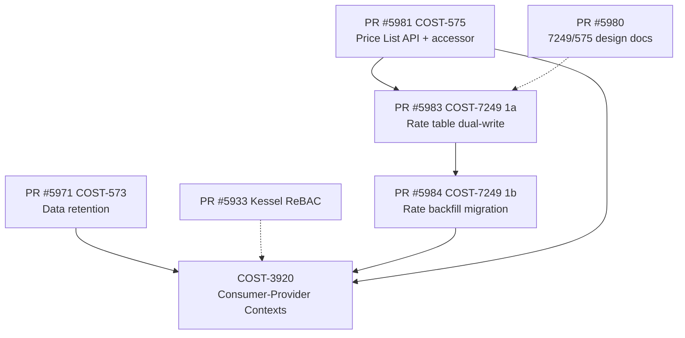

# PRD08 / COST-3920 — Consumer-Provider Cost Models

Technical due diligence of **PRD08 (COST-3920)** against the current koku
codebase and in-flight PRs. This document serves as the foundation for
the technical design phase.

**PRD**: Consumer-Provider Cost Models (cost model contexts)
**Jira Epic**: [COST-3920](https://redhat.atlassian.net/browse/COST-3920)

---

## Document Catalog

| # | Document | Type | Description |
|---|----------|------|-------------|
| 1 | [README.md](README.md) | DD | Due diligence overview, PRD-to-code gap analysis, dependency graph |
| 2 | [current-architecture.md](current-architecture.md) | DD | Current cost model architecture: models, manager, pipeline, API |
| 3 | [prd-gap-analysis.md](prd-gap-analysis.md) | DD | Section-by-section PRD requirement vs codebase feasibility |
| 4 | [dependency-analysis.md](dependency-analysis.md) | DD | In-flight PR analysis, merge ordering, conflict risks |
| 5 | [risk-register.md](risk-register.md) | DD | Risk register: 20 risks, all TL questions resolved |
| 6 | [test-plan.md](test-plan.md) | TP | IEEE 829 test plan: 97 test cases, 38 BACs, 4 tiers, migration-first deployment |

**Reading order**: 2 → 3 → 4 → 5 → 6 → 1 (this file is the summary)

---

## Executive Summary

The PRD introduces **cost model contexts** — a mechanism for attaching
multiple cost models to the same OCP cluster, each in a different
"context" (e.g., Provider vs Consumer). After a thorough analysis of
the codebase, the following high-level findings emerged:

### What the codebase already supports

1. **`CostModelMap` schema allows multiple rows per provider** — the
   `unique_together = ("provider_uuid", "cost_model")` constraint
   permits a provider to have rows for different cost models. The
   one-model-per-provider limit is **application-level only** (in
   `CostModelManager.update_provider_uuids`).

2. **`PriceList` + `PriceListCostModelMap` with priority** — the
   infrastructure for versioned, prioritized price lists per cost
   model already exists (from COST-575/COST-7249 work).

3. **AWS `cost_type` pattern** — a well-established pattern for
   switching between different cost views on the same data exists
   in the AWS report path (serializer → query parameter →
   provider_map → conditional ORM aggregates). OCP can mirror this.

4. **`cost_model_rate_type` column** — the
   `reporting_ocpusagelineitem_daily_summary` table already has a
   `cost_model_rate_type` field used to partition cost rows by type
   (Infrastructure, Supplementary, platform_distributed, etc.).

### What requires significant new work

1. **`CostModelMap` needs a `context` column** — the assignment table
   lacks any concept of context. A new column + migration + unique
   constraint `(provider_uuid, context)` is needed.

2. **`CostModelContext` model** — a new tenant-scoped model to store
   the available contexts (max 3), one designated as default. No
   analogue exists today.

3. **Pipeline must run N times per cluster** — currently
   `CostModelDBAccessor` resolves one cost model per provider via
   `.first()`. The entire OCP cost pipeline (usage_costs.sql,
   monthly_cost, distribution, UI summary) must execute per-context.

4. **Reporting tables need a context dimension** — the summary tables
   (`reporting_ocp_*_summary_p`) and the daily summary table do not
   have a context column. Cost data for different contexts must be
   distinguishable.

5. **RBAC has no context dimension** — Koku's RBAC parser flattens
   `attributeFilter` values into a single list per resource type.
   Adding a "context" property requires either:
   - Extending the RBAC service contract + Koku's ACL parser
   - New resource definitions in Kessel ReBAC (SpiceDB schema)
   - A Koku-side authorization layer for contexts

6. **API query parameter + UI dropdown** — OCP report serializers
   have no `cost_model_context` parameter. Needs threading through
   serializer → QueryParameters → OCPReportQueryHandler →
   OCPProviderMap → ORM filter/annotation.

### Critical unknowns

| # | Unknown | Impact |
|---|---------|--------|
| U1 | RBAC service willingness to add "context" property to cost-management ACLs | Blocks RBAC integration; may force Koku-side auth |
| U2 | On-prem vs SaaS scope — is this feature on-prem only, SaaS only, or both? | Affects RBAC path (Kessel vs platform RBAC), migration strategy, UI gating |
| U3 | Interaction with OCP-on-cloud (PRD says out of scope) — but infrastructure cost rows from cloud bills also appear in OCP summaries | Clarify whether cloud-backed clusters can have contexts |
| U4 | Storage multiplier — 3 contexts × all clusters × all months = 3× data volume in summary tables | Capacity planning, query performance, retention interaction |
| U5 | Relationship between COST-3920 contexts and COST-7249 cost breakdown (Rate table) | Both modify cost model assignment and reporting; sequencing matters |

---

## PRD Requirement Summary

| PRD Section | Requirement | Feasibility | Effort |
|-------------|-------------|-------------|--------|
| **Context setup** | CostModelContext model, max 3, one default | Straightforward | Low |
| **RBAC integration** | Groups see only permitted contexts | Hard — cross-service | High |
| **Cost model creation** | Unchanged (context-free) | No work needed | None |
| **Assignment** | Context on CostModelMap, one model per context per cluster | Moderate — schema + manager + serializer | Medium |
| **Default metering** | Empty context still reports usage at $0 | Exists today (no cost model = $0 cost) | Low |
| **Pipeline** | Per-context cost calculation | Hard — pipeline restructuring | High |
| **Reporting tables** | Context dimension on summary tables | Hard — migration + SQL rewrite | High |
| **API** | `cost_model_context` query parameter | Moderate — follow AWS pattern | Medium |
| **UI** | Context dropdown, notifications | Frontend — out of koku scope | N/A |
| **Migration** | Default "Consumer" context, assign existing data | Moderate — data migration | Medium |

---

## Dependency Graph (In-Flight PRs)

**Recommended merge order**:
1. PR #5981 (COST-575 Price List API) — foundation
2. PR #5983 → PR #5984 (COST-7249 Rate table) — depends on #5981
3. PR #5980 (design docs) — anytime
4. PR #5971 (COST-573 retention) — parallel, but before COST-3920
5. PR #5933 (Kessel ReBAC) — parallel, informs COST-3920 auth path
6. COST-3920 — after all above

---

## Changelog

| Version | Date | Summary |
|---------|------|---------|
| v1.0 | 2026-04-08 | Initial due diligence: codebase exploration, PRD gap analysis, dependency graph |
