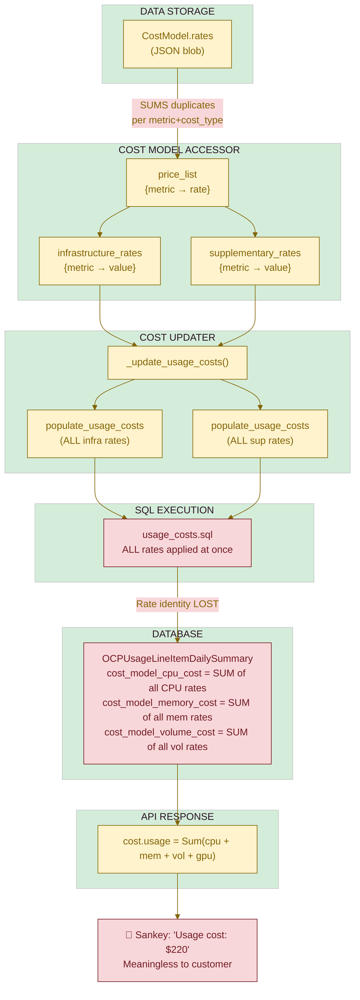
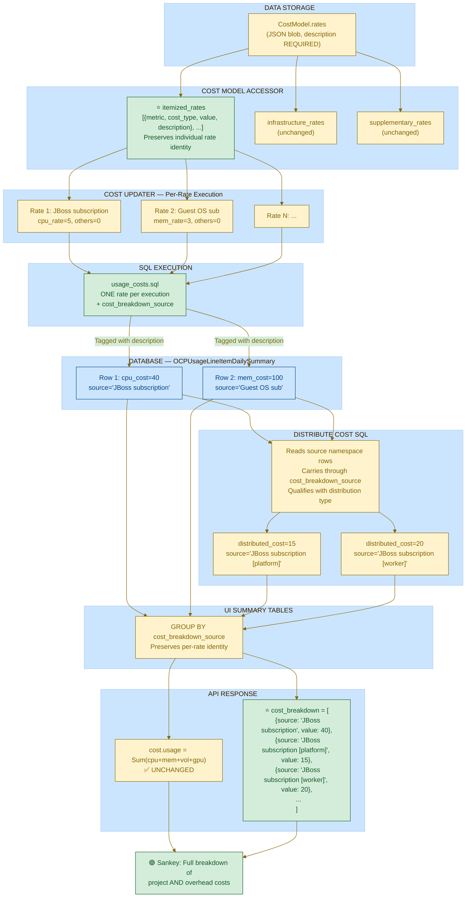

# Detailed Design: Cost Breakdown by Rate Description (COST-2105)

**Date**: 2026-02-06
**Version**: 1.4
**Status**: Detailed Design (DD)
**Scope**: OCP Provider - Phase 1 (Price List Constituents)
**Related PRD**: PRD04 COST-2105
**Related Jiras**: [COST-2105](https://issues.redhat.com/browse/COST-2105), [COST-4415](https://issues.redhat.com/browse/COST-4415)

---

## Table of Contents

- [Executive Summary](#executive-summary)
- [Problem Statement](#problem-statement)
  - [Current State](#current-state)
  - [Desired State](#desired-state)
- [Requirements](#requirements)
  - [Phase 1: Price List Constituents (This Document)](#phase-1-price-list-constituents-this-document)
  - [Phase 2: Cloud Service Constituents (Future)](#phase-2-cloud-service-constituents-future)
- [Architecture Decisions](#architecture-decisions)
  - [AD-1: Per-Rate SQL Execution](#ad-1-per-rate-sql-execution)
  - [AD-2: Generic `cost_breakdown_source` Column](#ad-2-generic-cost_breakdown_source-column)
  - [AD-3: Pattern A - Carry Metadata Through Unified Table](#ad-3-pattern-a---carry-metadata-through-unified-table)
  - [AD-4: New API Response Field](#ad-4-new-api-response-field)
  - [AD-5: Mandatory Rate Description](#ad-5-mandatory-rate-description)
- [Schema Changes](#schema-changes)
  - [New Column: `cost_breakdown_source`](#new-column-cost_breakdown_source)
  - [Migration Strategy](#migration-strategy)
  - [Downstream Summary Tables](#downstream-summary-tables)
- [Implementation Details](#implementation-details)
  - [1. Cost Model Serializer Changes](#1-cost-model-serializer-changes)
  - [2. Cost Model DB Accessor Changes](#2-cost-model-db-accessor-changes)
  - [3. Cost Updater Changes](#3-cost-updater-changes)
  - [4. SQL Template Changes](#4-sql-template-changes)
  - [5. UI Summary Table SQL Changes](#5-ui-summary-table-sql-changes)
  - [6. API Layer Changes](#6-api-layer-changes)
- [Data Flow](#data-flow)
  - [Current Flow](#current-flow)
  - [New Flow](#new-flow)
- [Phase 2 Extensibility](#phase-2-extensibility)
- [Affected Files](#affected-files)
- [Resolved Questions](#resolved-questions)
- [Changelog](#changelog)

---

## Executive Summary

The current Koku Sankey cost breakdown diagram uses abstract accounting categories (raw cost, usage cost, markup, overhead) that do not map to concepts customers understand. This design replaces those abstract categories with the **actual rate descriptions from the customer's cost model price list** (e.g., "JBoss subscription", "Guest OS subscription (RHEL)", "Quota charge").

Phase 1 covers OCP standalone cost model rates. Phase 2 (future, COST-4415) extends the same mechanism to cloud service constituents (AmazonEC2, AmazonRDS, etc.) for OCP-on-cloud, requiring no architectural changes.

---

## Problem Statement

### Current State

The Sankey diagram groups costs into fixed abstract categories:

```
Total cost ($9,343.15)
├── Project ($12.46)
│   ├── Raw cost ($8.66)
│   ├── Markup (-$4.33)
│   └── Usage cost ($8.12)
└── Overhead cost ($9,330.70)
    ├── Network unattributed ($9.87)
    ├── Platform distributed ($1,474.43)
    ├── Storage unattributed ($0.00)
    └── Worker unallocated ($7,846.40)
```

Customers do not recognize "raw cost" or "usage cost" as meaningful categories. They want to see their actual cost model line items.

### Desired State

The Sankey diagram breaks costs into the rate descriptions from the customer's price list:

**Level 1 — High-level overhead categories** (existing behavior, preserved):

```
Total cost (969)
├── Project (772)
│   ├── JBoss subscription (40)
│   ├── Guest OS subscription (RHEL) (100)
│   ├── Quota charge (80)
│   ├── AmazonEC2 (201)           ← Phase 2
│   ├── Red Hat OpenShift Service on AWS (197)  ← Phase 2
│   ├── AmazonRDS (73)            ← Phase 2
│   ├── AWSDataTransfer (12)      ← Phase 2
│   └── Markup (108)
└── Overhead cost (197)
    ├── Platform distributed (59)
    ├── Worker unallocated (79)
    ├── Storage unattributed (11)
    └── Network unattributed (8)
```

**Level 2 — Per-rate overhead drill-down** (new capability):

```
Overhead cost (197)
├── Platform distributed (59)
│   ├── JBoss subscription [platform] (15)
│   ├── Guest OS subscription (RHEL) [platform] (25)
│   └── Quota charge [platform] (19)
├── Worker unallocated (79)
│   ├── JBoss subscription [worker] (20)
│   ├── Guest OS subscription (RHEL) [worker] (30)
│   └── Quota charge [worker] (29)
├── Storage unattributed (11)
└── Network unattributed (8)
```

The API provides **both levels** simultaneously. The existing `cost.platform_distributed`,
`cost.worker_unallocated_distributed`, etc. fields continue to provide the aggregated
overhead totals (Level 1). The new `cost_breakdown` field provides the per-rate detail
(Level 2), where each distributed entry is qualified with the distribution type
(e.g., "JBoss subscription [platform]" means JBoss subscription cost from the Platform
namespace distributed to this project). The frontend can use Level 1 for the default
Sankey view and Level 2 for drill-down.

---

## Requirements

### Phase 1: Price List Constituents (This Document)

| ID | Requirement | Details |
|----|-------------|---------|
| R1 | Rate description mandatory | The `description` field on `RateSerializer` must be required (not optional) for all new rates |
| R2 | Per-rate cost tracking | Each rate in the cost model produces separately identifiable cost entries in the database |
| R3 | API cost breakdown field | A new `cost_breakdown` field in the API response provides a list of cost constituents with source descriptions |
| R4 | Usage rates broken out | Usage-based rates (CPU, memory, storage, node, cluster) produce individual entries per rate description |
| R5 | Monthly costs broken out | Monthly fixed costs (Node, Cluster, PVC, VM) produce individual entries per rate description |
| R6 | Tag rates broken out | Tag-based rates produce individual entries per tag key/value. `cost_breakdown_source` uses the tag-value description if set, else the rate-level description, else the metric name |
| R7 | Distributed costs broken out | Distributed costs (platform, worker, storage, network, GPU) carry through the `cost_breakdown_source` from the original source namespace rows, qualified with the distribution type (e.g., "JBoss subscription [platform]") |
| R8 | Markup as API-level aggregate | Markup is an UPDATE on existing rows (not INSERT), so it cannot have its own `cost_breakdown_source`. A synthetic "Markup" entry is computed at the API layer by summing `infrastructure_markup_cost` across all rows |
| R9 | Backward compatibility | Existing API fields (`cost.raw`, `cost.usage`, `cost.markup`, etc.) continue to work unchanged |
| R10 | Individual rate breakout | When multiple rates exist for the same metric+cost_type, each appears as a separate entry (not summed) |

### Phase 2: Cloud Service Constituents (Future)

| ID | Requirement | Details |
|----|-------------|---------|
| R11 | Cloud service tracking | Infrastructure raw cost entries carry the cloud service name (e.g., "AmazonEC2") |
| R12 | Back-populate extension | Cloud back-populate SQL carries `product_code`/`service_name` into `cost_breakdown_source` |
| R13 | Same API field | Phase 2 data appears in the same `cost_breakdown` API field as Phase 1 |

---

## Architecture Decisions

### AD-1: Per-Rate SQL Execution

**Context**: The current [`usage_costs.sql`](../../koku/masu/database/sql/openshift/cost_model/usage_costs.sql) applies ALL rates simultaneously in a single SQL execution, producing one aggregated row per (namespace, node, date, ...) group. Individual rate identity is lost.

**Decision**: Execute `usage_costs.sql` once per individual rate, setting only that rate's parameter non-zero and all others to 0. Each execution tags the rows with the rate's description via `cost_breakdown_source`.

**Rationale**:
- Consistent with how the rest of the pipeline already works:
  - Monthly costs: one call per cost_type (Node, Cluster, PVC) — see [`populate_monthly_cost_sql`](../../koku/masu/database/ocp_report_db_accessor.py)
  - Tag rates: one call per tag_key/tag_value — see [`_update_tag_usage_costs`](../../koku/masu/processor/ocp/ocp_cost_model_cost_updater.py)
  - Distributed costs: one call per distribution type — see [`populate_distributed_cost_sql`](../../koku/masu/database/ocp_report_db_accessor.py)
- Usage costs was the only outlier that batched all rates together
- Performance impact is modest: most cost models define 2-6 usage rates; instead of 2 SQL calls (Infrastructure + Supplementary), we make ~4-8

**Consequences**:
- More rows in `reporting_ocpusagelineitem_daily_summary` (one per rate instead of one aggregated)
- New `CostModelDBAccessor.itemized_rates` property provides individual rates (existing `price_list` unchanged)
- Existing API aggregation still sums correctly via `Sum()` annotations

### AD-2: Generic `cost_breakdown_source` Column

**Context**: We need to track the origin/description of each cost entry. This could be a rate description (Phase 1) or a cloud service name (Phase 2).

**Decision**: Add a single `cost_breakdown_source` `TextField` to `OCPUsageLineItemDailySummary` that is agnostic to the source type.

**Rationale**:
- One column serves both phases — no schema changes needed for Phase 2
- Follows the existing pattern of `cost_model_rate_type` as a text classifier on rows
- Simpler than a FK to a lookup table (rate descriptions are user-defined free text)

**Values by cost type**:

| Cost Type | Phase | `cost_breakdown_source` Value |
|-----------|-------|-------------------------------|
| Usage rate | 1 | Rate description (e.g., "JBoss subscription") |
| Monthly cost | 1 | Rate description (e.g., "Node monthly cost") |
| Tag rate | 1 | Tag-value description if set → rate-level description → metric name fallback (e.g., "Production environment", "JBoss tag rate", "cpu_core_usage_per_hour") |
| Markup | 1 | **No database column** — Markup is applied via `UPDATE` on existing rows. A synthetic "Markup" entry is computed at the API layer (see Section 6c) |
| Distributed cost | 1 | Carried from source namespace's `cost_breakdown_source` + distribution qualifier (e.g., "JBoss subscription [platform]", "Guest OS subscription [worker]"). Unattributed costs without rate origin: "Storage unattributed", "Network unattributed" |
| Cloud service | 2 | Cloud service name (e.g., "AmazonEC2", "AmazonRDS") |

### AD-3: Pattern A - Carry Metadata Through Unified Table

**Context**: For Phase 2, cloud service names exist in cloud-specific tables (e.g., `product_code` in `OCPAWSCostLineItemProjectDailySummaryP`) but are lost during back-populate into `OCPUsageLineItemDailySummary`.

**Decision**: Follow Pattern A — carry `cost_breakdown_source` through the back-populate SQL into the unified table, consistent with how `cost_category_id` is already carried.

**Rationale**:
- All API queries work against `OCPUsageLineItemDailySummary` (or its partitioned summary tables)
- Avoids separate query paths per cloud provider at the API layer
- The back-populate SQL template is straightforward to extend (add column to INSERT/SELECT)

### AD-4: New API Response Field

**Context**: The current API response has a fixed nested structure for cost categories. The new breakdown needs a dynamic list of constituents.

**Decision**: Add a new `cost_breakdown` field alongside the existing `cost` field in the API response.

**Response structure**:

```json
{
  "cost": {
    "raw": {"value": 201.00, "units": "USD"},
    "usage": {"value": 220.00, "units": "USD"},
    "markup": {"value": 108.00, "units": "USD"},
    "platform_distributed": {"value": 59.00, "units": "USD"},
    "worker_unallocated_distributed": {"value": 79.00, "units": "USD"},
    "storage_unattributed_distributed": {"value": 11.00, "units": "USD"},
    "network_unattributed_distributed": {"value": 8.00, "units": "USD"},
    "distributed": {"value": 157.00, "units": "USD"},
    "total": {"value": 686.00, "units": "USD"}
  },
  "cost_breakdown": [
    {"source": "JBoss subscription", "value": 40.00, "units": "USD"},
    {"source": "Guest OS subscription (RHEL)", "value": 100.00, "units": "USD"},
    {"source": "Quota charge", "value": 80.00, "units": "USD"},
    {"source": "Markup", "value": 108.00, "units": "USD"},
    {"source": "AmazonEC2", "value": 201.00, "units": "USD"},
    {"source": "JBoss subscription [platform]", "value": 15.00, "units": "USD"},
    {"source": "Guest OS subscription (RHEL) [platform]", "value": 25.00, "units": "USD"},
    {"source": "Quota charge [platform]", "value": 19.00, "units": "USD"},
    {"source": "JBoss subscription [worker]", "value": 20.00, "units": "USD"},
    {"source": "Guest OS subscription (RHEL) [worker]", "value": 30.00, "units": "USD"},
    {"source": "Quota charge [worker]", "value": 29.00, "units": "USD"},
    {"source": "Storage unattributed", "value": 11.00, "units": "USD"},
    {"source": "Network unattributed", "value": 8.00, "units": "USD"}
  ]
}
```

The `cost` object provides **Level 1** (aggregated overhead categories — unchanged from today).
The `cost_breakdown` list provides **Level 2** (per-rate detail for both project and overhead costs).

> **Note**: The "Markup" entry in `cost_breakdown` is a **synthetic API-level entry** — it is not stored in `cost_breakdown_source` in the database. It is computed by summing `infrastructure_markup_cost` across all matching rows and appended to the list by the query handler. The "AmazonEC2" entry is a Phase 2 placeholder.
The frontend uses `cost.*` for the high-level Sankey and `cost_breakdown` for drill-down.

**Rationale**:
- Backward compatible: existing `cost.*` fields unchanged, including overhead aggregates
- Two-level detail: Level 1 for overview, Level 2 for drill-down
- Dynamic: variable number of entries based on the customer's cost model
- Generic: same structure works for rate descriptions (Phase 1) and cloud services (Phase 2)

### AD-5: Mandatory Rate Description

**Context**: Rate `description` is currently optional (`required=False, allow_blank=True`) in `RateSerializer`. For the Sankey to work, every rate must have a description.

**Decision**: Make `description` required for new cost models. Existing cost models without descriptions will use the metric name as a fallback.

**Rationale**:
- Cannot break existing cost models that lack descriptions
- Fallback to metric name (e.g., "cpu_core_usage_per_hour") is ugly but functional
- New cost models going forward will have meaningful descriptions

---

## Schema Changes

### New Column: `cost_breakdown_source`

**Table**: `reporting_ocpusagelineitem_daily_summary`

```python
cost_breakdown_source = models.TextField(null=True)
```

- **Type**: `TextField` (nullable)
- **Null when**: Original ingested rows that have no cost model applied yet
- **Indexed**: No (queried via aggregation, not direct lookup)

### Migration Strategy

**Step 1**: Add `cost_breakdown_source` to `OCPUsageLineItemDailySummary`

```python
# Migration: XXXX_add_cost_breakdown_source.py
migrations.AddField(
    model_name="ocpusagelineitemdailysummary",
    name="cost_breakdown_source",
    field=models.TextField(null=True),
),
```

**Step 2**: Add `cost_breakdown_source` to all downstream summary tables that need the breakdown:

- `OCPCostSummaryByProjectP` (`reporting_ocp_cost_summary_by_project_p`)
- `OCPCostSummaryP` (`reporting_ocp_cost_summary_p`)
- `OCPCostSummaryByNodeP` (`reporting_ocp_cost_summary_by_node_p`)

These are the tables used by the `costs_by_project` report type. Other summary tables (pod, volume, network, GPU) do not serve cost breakdown data and can be extended later if needed.

### Downstream Summary Tables

The following models need the new column added:

| Model | Table | Used by |
|-------|-------|---------|
| `OCPCostSummaryByProjectP` | `reporting_ocp_cost_summary_by_project_p` | `costs_by_project` report |
| `OCPCostSummaryP` | `reporting_ocp_cost_summary_p` | `costs` report |
| `OCPCostSummaryByNodeP` | `reporting_ocp_cost_summary_by_node_p` | `costs_by_node` report |

---

## Implementation Details

### 1. Cost Model Serializer Changes

**File**: [`koku/cost_models/serializers.py`](../../koku/cost_models/serializers.py)

**Change**: Make `description` required on `RateSerializer`.

```python
# Before
description = serializers.CharField(allow_blank=True, max_length=500, required=False)

# After
description = serializers.CharField(max_length=500, required=True)
```

**Backward compatibility**: Existing cost models stored in the DB already have their rates in the `CostModel.rates` JSONField. The serializer change only affects new cost model creation/update via the API. Existing cost models without descriptions will use the metric name fallback in the accessor (see section 2).

### 2. Cost Model DB Accessor Changes

**File**: [`koku/masu/database/cost_model_db_accessor.py`](../../koku/masu/database/cost_model_db_accessor.py)

**New property**: `itemized_rates` — returns individual rates with descriptions, without pre-summing.

```python
@property
def itemized_rates(self):
    """Return individual rates with descriptions, preserving per-rate identity.

    Returns a list of dicts:
    [
        {
            "metric": "cpu_core_usage_per_hour",
            "cost_type": "Infrastructure",
            "value": 5.0,
            "description": "JBoss subscription",
        },
        ...
    ]
    """
    result = []
    if not self.cost_model:
        return result
    rates = copy.deepcopy(self.cost_model.rates)
    for rate in rates:
        if not rate.get("tiered_rates"):
            continue
        metric_name = rate.get("metric", {}).get("name")
        cost_type = rate["cost_type"]
        description = rate.get("description") or metric_name  # fallback to metric name
        tiered_rates = rate.get("tiered_rates", [])
        if tiered_rates:
            value = float(tiered_rates[0].get("value", 0))
            result.append({
                "metric": metric_name,
                "cost_type": cost_type,
                "value": value,
                "description": description,
            })
    return result
```

**Existing properties preserved**: `price_list`, `infrastructure_rates`, `supplementary_rates` remain unchanged for backward compatibility with any code paths that don't need per-rate breakdown.

**Tag rate description propagation**: The existing `tag_based_price_list`, `tag_infrastructure_rates`, `tag_supplementary_rates`, and `tag_default_*` properties currently strip the `description` field from rate entries during processing. These must be extended to carry through the description using the resolution order defined in Section 4f (tag-value description → rate-level description → metric name).

### 3. Cost Updater Changes

**File**: [`koku/masu/processor/ocp/ocp_cost_model_cost_updater.py`](../../koku/masu/processor/ocp/ocp_cost_model_cost_updater.py)

#### 3a. `__init__` — Load itemized rates

```python
def __init__(self, schema, provider):
    super().__init__(schema, provider, None)
    # ... existing code ...
    with CostModelDBAccessor(self._schema, self._provider_uuid) as cost_model_accessor:
        # ... existing assignments ...
        self._itemized_rates = cost_model_accessor.itemized_rates  # NEW
```

#### 3b. `_update_usage_costs` — Per-rate execution

**Current behavior**: Iterates over `{Infrastructure, Supplementary}`, calls `populate_usage_costs` once per type with all rates.

**New behavior**: Iterates over `self._itemized_rates`, calls `populate_usage_costs` once per individual rate with only that rate's metric set and its description.

```python
def _update_usage_costs(self, start_date, end_date):
    """Update infrastructure and supplementary usage costs."""
    with OCPReportDBAccessor(self._schema) as report_accessor:
        report_period = report_accessor.report_periods_for_provider_uuid(
            self._provider.uuid, start_date
        )
        if not report_period:
            return
        report_period_id = report_period.id

        # Filter to usage-rate metrics only
        usage_rates = [
            r for r in self._itemized_rates
            if r["metric"] in metric_constants.COST_MODEL_USAGE_RATES
        ]

        # Step 1: Bulk delete ALL existing usage-cost rows per cost_type
        # (before the per-rate insert loop to avoid cross-rate deletion)
        for cost_type in (metric_constants.INFRASTRUCTURE_COST_TYPE,
                          metric_constants.SUPPLEMENTARY_COST_TYPE):
            report_accessor.delete_usage_costs(
                cost_type, start_date, end_date,
                self._provider.uuid, report_period_id,
            )

        # Step 2: Insert per-rate (INSERT only, no DELETE)
        for rate_info in usage_rates:
            single_rate = {rate_info["metric"]: rate_info["value"]}
            report_accessor.populate_usage_costs(
                rate_info["cost_type"],           # "Infrastructure" or "Supplementary"
                filter_dictionary(single_rate, metric_constants.COST_MODEL_USAGE_RATES),
                self._distribution,
                start_date,
                end_date,
                self._provider.uuid,
                report_period_id,
                cost_breakdown_source=rate_info["description"],  # NEW parameter
            )
```

**Note**: The existing `_update_monthly_cost` method already iterates per cost_type. We add the `cost_breakdown_source` parameter to `populate_monthly_cost_sql` calls, using the rate description. Similar changes apply to tag rate methods.

#### 3c. `_update_monthly_cost` — Add description

```python
def _update_monthly_cost(self, start_date, end_date):
    with OCPReportDBAccessor(self._schema) as report_accessor:
        for cost_type, rate_term in OCPUsageLineItemDailySummary.MONTHLY_COST_RATE_MAP.items():
            rate_type = None
            rate = None
            description = None
            if self._infra_rates.get(rate_term):
                rate_type = metric_constants.INFRASTRUCTURE_COST_TYPE
                rate = self._infra_rates.get(rate_term)
            elif self._supplementary_rates.get(rate_term):
                rate_type = metric_constants.SUPPLEMENTARY_COST_TYPE
                rate = self._supplementary_rates.get(rate_term)

            # Resolve description from itemized_rates
            for r in self._itemized_rates:
                if r["metric"] == rate_term and r["cost_type"] == rate_type:
                    description = r["description"]
                    break

            amortized_rate = get_amortized_monthly_cost_model_rate(rate, start_date)
            report_accessor.populate_monthly_cost_sql(
                cost_type,
                rate_type,
                amortized_rate,
                start_date,
                end_date,
                self._distribution,
                self._provider_uuid,
                cost_breakdown_source=description,  # NEW parameter
            )
```

### 4. SQL Template Changes

#### 4a. `usage_costs.sql` — Split into Delete + Insert

**File**: [`koku/masu/database/sql/openshift/cost_model/usage_costs.sql`](../../koku/masu/database/sql/openshift/cost_model/usage_costs.sql)

**Changes**:
1. **Extract the DELETE** into a separate method (`delete_usage_costs`) or SQL file, called once per cost_type before the per-rate loop (see [Delete Strategy](#delete-strategy-for-per-rate-execution))
2. **Remove the DELETE** from `usage_costs.sql`, leaving only the INSERT (CTE + SELECT)
3. Add `cost_breakdown_source` to the INSERT column list
4. Add `{{cost_breakdown_source}}` to the SELECT expression

```sql
-- usage_costs.sql (INSERT only, DELETE handled separately)
INSERT INTO {{schema | sqlsafe}}.reporting_ocpusagelineitem_daily_summary (
    uuid,
    -- ... existing columns ...
    cost_category_id,
    all_labels,
    cost_breakdown_source  -- NEW
)
-- ... CTE unchanged ...
SELECT uuid_generate_v4(),
    -- ... existing expressions ...
    lids.cost_category_id,
    lids.all_labels,
    {{cost_breakdown_source}} as cost_breakdown_source  -- NEW
FROM ...
```

#### 4b. `monthly_cost_cluster_and_node.sql`

**File**: [`koku/masu/database/sql/openshift/cost_model/monthly_cost_cluster_and_node.sql`](../../koku/masu/database/sql/openshift/cost_model/monthly_cost_cluster_and_node.sql)

**Same pattern**: Add `cost_breakdown_source` to INSERT/SELECT.

#### 4c. `monthly_cost_persistentvolumeclaim.sql`

**Same pattern**: Add `cost_breakdown_source` to INSERT/SELECT.

#### 4d. `monthly_cost_virtual_machine.sql`

**Same pattern**: Add `cost_breakdown_source` to INSERT/SELECT.

#### 4e. Distribute cost SQL files

**Files**:
- [`distribute_platform_cost.sql`](../../koku/masu/database/sql/openshift/cost_model/distribute_cost/distribute_platform_cost.sql)
- [`distribute_worker_cost.sql`](../../koku/masu/database/sql/openshift/cost_model/distribute_cost/distribute_worker_cost.sql)
- [`distribute_unattributed_storage_cost.sql`](../../koku/masu/database/sql/openshift/cost_model/distribute_cost/distribute_unattributed_storage_cost.sql)
- [`distribute_unattributed_network_cost.sql`](../../koku/masu/database/sql/openshift/cost_model/distribute_cost/distribute_unattributed_network_cost.sql)

**Change**: The distribute SQL reads costs from source namespaces (Platform, Worker unallocated, etc.) and redistributes them proportionally to user project namespaces. The source rows already have `cost_breakdown_source` set from the rate that created them. The distribute SQL must:

1. **Carry through** the `cost_breakdown_source` from the source namespace rows
2. **Qualify it** with the distribution type to distinguish project-direct costs from distributed overhead
3. **Group by** `cost_breakdown_source` so that each rate's contribution is distributed separately

The qualification format is: `source_description [distribution_type]`

```sql
-- In distribute_platform_cost.sql:
-- Instead of a single aggregated distributed_cost row, produce one row
-- per cost_breakdown_source from the source (Platform) namespace.
CONCAT(source.cost_breakdown_source, ' [platform]') as cost_breakdown_source
```

This means if the Platform namespace has costs from "JBoss subscription" ($30) and "Guest OS subscription" ($20), and a user project gets 50% of the distributed cost, the project receives two distributed rows:
- "JBoss subscription [platform]": $15
- "Guest OS subscription [platform]": $10

For **unattributed costs** (`distribute_unattributed_storage_cost.sql`, `distribute_unattributed_network_cost.sql`), these costs do not originate from user-defined rates — they are system-level costs. Their `cost_breakdown_source` is set to the distribution type name directly: `"Storage unattributed"`, `"Network unattributed"`.

#### 4f. Tag rate SQL files

**Files**:
- [`infrastructure_tag_rates.sql`](../../koku/masu/database/sql/openshift/cost_model/infrastructure_tag_rates.sql)
- [`supplementary_tag_rates.sql`](../../koku/masu/database/sql/openshift/cost_model/supplementary_tag_rates.sql)

**Change**: Add `cost_breakdown_source` parameter, populated with the tag rate description.

**Description resolution order** (most granular first):
1. **Tag-value description** — `TagRateValueSerializer.description` stores a per-value description (e.g., "Production environment"). If set, use this.
2. **Rate-level description** — the top-level `description` on the rate entry (e.g., "JBoss tag rate"). If the tag-value description is blank/null, fall back to this.
3. **Metric name** — the `metric.name` constant (e.g., `cpu_core_usage_per_hour`). Last resort fallback.

**Implementation detail**: `CostModelDBAccessor.tag_based_price_list` and its derivatives (`tag_infrastructure_rates`, `tag_supplementary_rates`, `tag_default_infrastructure_rates`, etc.) currently strip the `description` field during processing. These must be modified to propagate description through to the returned dict structure, so that `_update_tag_usage_costs` and `_update_monthly_tag_based_cost` in the cost updater can pass it to `populate_tag_usage_costs`.

The SQL templates receive the description as a Jinja2 parameter and include it in the `INSERT ... SELECT` as:

```sql
{{cost_breakdown_source}} as cost_breakdown_source
```

#### 4g. Markup — API-Level Approach

Markup costs are applied via [`_update_markup_cost`](../../koku/masu/processor/ocp/ocp_cost_model_cost_updater.py), which calls `populate_markup_cost`. This method uses a Django ORM `.update()` on **existing** daily summary rows to set the `infrastructure_markup_cost` column. It does **not** insert new rows.

Because markup is an UPDATE on rows that already have a `cost_breakdown_source` (from usage/monthly/tag rates), assigning `cost_breakdown_source = 'Markup'` on those same rows would overwrite the original rate description. Therefore:

- **No database change for markup** — `cost_breakdown_source` is NOT modified during markup application.
- **API-level "Markup" entry** — the `cost_breakdown` list in the API response includes a synthetic "Markup" entry computed by summing `infrastructure_markup_cost` across all matching rows. This is handled in the provider_map annotation or query handler (see Section 6c).

### 5. UI Summary Table SQL Changes

**Files** in `koku/masu/database/sql/openshift/ui_summary/`:
- `reporting_ocp_cost_summary_by_project_p.sql`
- `reporting_ocp_cost_summary_p.sql`
- `reporting_ocp_cost_summary_by_node_p.sql`

**Changes**:
1. Add `cost_breakdown_source` to the INSERT column list
2. Add `cost_breakdown_source` to the SELECT expression
3. Add `cost_breakdown_source` to the GROUP BY clause

This ensures that per-rate rows in the daily summary table are preserved (not re-aggregated) in the UI summary tables, so the API can query them for the breakdown.

### 6. API Layer Changes

#### 6a. Provider Map — New Annotations

**File**: [`koku/api/report/ocp/provider_map.py`](../../koku/api/report/ocp/provider_map.py)

Add `cost_breakdown` annotation to the `costs_by_project` section:

```python
"annotations": {
    # ... existing annotations unchanged ...
    "cost_breakdown_source": F("cost_breakdown_source"),
    "cost_breakdown_value": (
        self.cloud_infrastructure_cost
        + self.markup_cost
        + self.cost_model_cost
        + self.distributed_platform_cost
        + self.distributed_worker_cost
        + self.distributed_unattributed_network_cost
        + self.distributed_unattributed_storage_cost
        + self.distributed_unallocated_gpu_cost
    ),
}
```

**Note**: The exact annotation structure depends on whether we group_by `cost_breakdown_source` or use `ArrayAgg`/`JSONObject` to produce the list. The `ArrayAgg(JSONObject(...))` pattern is already used in the codebase for virtual machine storage details — see `provider_map.py` lines 697-711. This is the preferred pattern.

```python
# Database-sourced breakdown (usage, monthly, tag, distributed costs)
"cost_breakdown": ArrayAgg(
    JSONObject(
        source=F("cost_breakdown_source"),
        value=Sum(
            Coalesce(F("cost_model_cpu_cost"), 0)
            + Coalesce(F("cost_model_memory_cost"), 0)
            + Coalesce(F("cost_model_volume_cost"), 0)
            + Coalesce(F("cost_model_gpu_cost"), 0)
            + Coalesce(F("infrastructure_raw_cost"), 0)
            + Coalesce(F("distributed_cost"), 0)
        ),
    ),
    filter=Q(cost_breakdown_source__isnull=False),
    distinct=True,
),
```

**Markup — synthetic API entry**: Because markup is an `UPDATE` on existing rows (not an INSERT), it does NOT have its own `cost_breakdown_source`. The "Markup" entry in `cost_breakdown` is computed separately in the query handler or provider_map by summing `infrastructure_markup_cost` across all matching rows:

```python
# Synthetic Markup entry (appended in query handler)
markup_total = queryset.aggregate(
    markup=Sum("infrastructure_markup_cost")
)["markup"]
if markup_total:
    cost_breakdown_list.append({
        "source": "Markup",
        "value": markup_total,
        "units": currency_units,
    })
```

**Design Note**: The exact aggregation expression above is illustrative. The actual implementation must account for the fact that each row has only ONE type of cost populated (a usage-rate row has `cost_model_*_cost`, a distributed row has `distributed_cost`, etc.). The aggregation needs to sum the appropriate non-null costs per `cost_breakdown_source` value. `infrastructure_markup_cost` is explicitly excluded from the `ArrayAgg` since it's handled by the synthetic entry. This will be refined during implementation.

#### 6b. Query Handler — PACK_DEFINITIONS

**File**: [`koku/api/report/ocp/query_handler.py`](../../koku/api/report/ocp/query_handler.py)

The `cost_breakdown` field is a list of objects, not a nested cost structure. It does NOT go through `PACK_DEFINITIONS` / `_pack_data_object`. Instead, it is passed through directly as an annotation value (similar to `clusters` and `source_uuid` which are `ArrayAgg` fields).

#### 6c. Response Serialization

The `cost_breakdown` field appears in the response as:

```json
{
  "date": "2026-01",
  "project": "my-project",
  "values": [{
    "cost": {
      "raw": {"value": 201.00, "units": "USD"},
      "usage": {"value": 220.00, "units": "USD"},
      "markup": {"value": 108.00, "units": "USD"},
      "platform_distributed": {"value": 59.00, "units": "USD"},
      "worker_unallocated_distributed": {"value": 79.00, "units": "USD"},
      "storage_unattributed_distributed": {"value": 11.00, "units": "USD"},
      "network_unattributed_distributed": {"value": 8.00, "units": "USD"},
      "distributed": {"value": 157.00, "units": "USD"},
      "total": {"value": 686.00, "units": "USD"}
    },
    "cost_breakdown": [
      {"source": "JBoss subscription", "value": 40.00, "units": "USD"},
      {"source": "Guest OS subscription (RHEL)", "value": 100.00, "units": "USD"},
      {"source": "Quota charge", "value": 80.00, "units": "USD"},
      {"source": "Markup", "value": 108.00, "units": "USD"},
      {"source": "JBoss subscription [platform]", "value": 15.00, "units": "USD"},
      {"source": "Guest OS subscription (RHEL) [platform]", "value": 25.00, "units": "USD"},
      {"source": "Quota charge [platform]", "value": 19.00, "units": "USD"},
      {"source": "JBoss subscription [worker]", "value": 20.00, "units": "USD"},
      {"source": "Guest OS subscription (RHEL) [worker]", "value": 30.00, "units": "USD"},
      {"source": "Quota charge [worker]", "value": 29.00, "units": "USD"},
      {"source": "Storage unattributed", "value": 11.00, "units": "USD"},
      {"source": "Network unattributed", "value": 8.00, "units": "USD"}
    ]
  }]
}
```

**Two-level relationship**:
- `cost.platform_distributed` ($59) = sum of all `[platform]` entries in `cost_breakdown` ($15 + $25 + $19)
- `cost.worker_unallocated_distributed` ($79) = sum of all `[worker]` entries in `cost_breakdown` ($20 + $30 + $29)
- `cost.storage_unattributed_distributed` ($11) = "Storage unattributed" in `cost_breakdown`
- `cost.network_unattributed_distributed` ($8) = "Network unattributed" in `cost_breakdown`
- `cost.markup` ($108) = "Markup" in `cost_breakdown` (synthetic entry, computed from `infrastructure_markup_cost` sum)

> **Note**: The "Markup" entry is a **synthetic API-level entry** — not stored in the database as `cost_breakdown_source`. It is computed by summing `infrastructure_markup_cost` across all matching rows and appended to the `cost_breakdown` list by the query handler.

The field also appears in the `total` section of the response with aggregated values across all projects.

---

## Data Flow

### Current Flow



### New Flow



---

## Phase 2 Extensibility

Phase 2 (COST-4415) adds cloud service constituents to the Sankey. The architecture is designed so that Phase 2 requires **no schema changes and no API changes** — only SQL template modifications:

### Back-populate SQL Changes

**Files**:
- `reporting_ocpaws_ocp_infrastructure_back_populate.sql`
- `reporting_ocpazure_ocp_infrastructure_back_populate.sql`
- `reporting_ocpgcp_ocp_infrastructure_back_populate.sql`

**Change**: Add `cost_breakdown_source` to INSERT/SELECT, populated from the cloud-specific column:

| Cloud Provider | Source Column | Example Values |
|---------------|---------------|----------------|
| AWS | `ocp_aws.product_code` | "AmazonEC2", "AmazonRDS", "AWSDataTransfer" |
| Azure | `ocp_azure.service_name` | "Virtual Machines", "Storage", "Bandwidth" |
| GCP | `ocp_gcp.service_alias` | "Compute Engine", "Cloud Storage", "Cloud SQL" |

**Python changes**: Add `cost_breakdown_source` column to back-populate INSERT lists in:
- `aws_report_db_accessor.py` — `back_populate_ocp_infrastructure_costs`
- `azure_report_db_accessor.py` — `back_populate_ocp_infrastructure_costs`
- `gcp_report_db_accessor.py` — `back_populate_ocp_infrastructure_costs`

No changes needed to:
- The `cost_breakdown_source` column definition (already exists from Phase 1)
- The API response structure (already handles dynamic `cost_breakdown` list)
- The UI summary table SQL (already groups by `cost_breakdown_source`)

---

## Affected Files

### Schema & Models

| File | Change |
|------|--------|
| `koku/reporting/provider/ocp/models.py` | Add `cost_breakdown_source` to `OCPUsageLineItemDailySummary`, `OCPCostSummaryP`, `OCPCostSummaryByProjectP`, `OCPCostSummaryByNodeP` |
| `koku/reporting/migrations/XXXX_*.py` | New migration for the column additions |

### Cost Model Serializer

| File | Change |
|------|--------|
| `koku/cost_models/serializers.py` | Make `description` required on `RateSerializer` |

### Cost Model Accessor

| File | Change |
|------|--------|
| `koku/masu/database/cost_model_db_accessor.py` | Add `itemized_rates` property; extend `tag_based_price_list`, `tag_infrastructure_rates`, `tag_supplementary_rates`, `tag_default_*` to propagate description field |

### Cost Updater

| File | Change |
|------|--------|
| `koku/masu/processor/ocp/ocp_cost_model_cost_updater.py` | Load `itemized_rates` in `__init__`, modify `_update_usage_costs` for per-rate execution, add `cost_breakdown_source` to `_update_monthly_cost`; modify `_update_tag_usage_costs` and `_update_monthly_tag_based_cost` to extract and pass tag-value/rate description |

### DB Accessor

| File | Change |
|------|--------|
| `koku/masu/database/ocp_report_db_accessor.py` | Add `delete_usage_costs` method (extracted from `usage_costs.sql`), add `cost_breakdown_source` parameter to `populate_usage_costs`, `populate_monthly_cost_sql`, `populate_tag_usage_costs`, `populate_distributed_cost_sql` (no markup change — markup remains an UPDATE without touching `cost_breakdown_source`) |

### SQL Templates

| File | Change |
|------|--------|
| `koku/masu/database/sql/openshift/cost_model/usage_costs.sql` | Remove DELETE (moved to separate call), add `cost_breakdown_source` to INSERT/SELECT |
| `koku/masu/database/sql/openshift/cost_model/monthly_cost_cluster_and_node.sql` | Add `cost_breakdown_source` to INSERT/SELECT |
| `koku/masu/database/sql/openshift/cost_model/monthly_cost_persistentvolumeclaim.sql` | Add `cost_breakdown_source` to INSERT/SELECT |
| `koku/masu/database/sql/openshift/cost_model/monthly_cost_virtual_machine.sql` | Add `cost_breakdown_source` to INSERT/SELECT |
| `koku/masu/database/sql/openshift/cost_model/distribute_cost/distribute_platform_cost.sql` | Add `cost_breakdown_source` |
| `koku/masu/database/sql/openshift/cost_model/distribute_cost/distribute_worker_cost.sql` | Add `cost_breakdown_source` |
| `koku/masu/database/sql/openshift/cost_model/distribute_cost/distribute_unattributed_storage_cost.sql` | Add `cost_breakdown_source` |
| `koku/masu/database/sql/openshift/cost_model/distribute_cost/distribute_unattributed_network_cost.sql` | Add `cost_breakdown_source` |
| `koku/masu/database/sql/openshift/cost_model/infrastructure_tag_rates.sql` | Add `cost_breakdown_source` |
| `koku/masu/database/sql/openshift/cost_model/supplementary_tag_rates.sql` | Add `cost_breakdown_source` |

### UI Summary SQL

| File | Change |
|------|--------|
| `koku/masu/database/sql/openshift/ui_summary/reporting_ocp_cost_summary_p.sql` | Add `cost_breakdown_source` to INSERT/SELECT/GROUP BY |
| `koku/masu/database/sql/openshift/ui_summary/reporting_ocp_cost_summary_by_project_p.sql` | Add `cost_breakdown_source` to INSERT/SELECT/GROUP BY |
| `koku/masu/database/sql/openshift/ui_summary/reporting_ocp_cost_summary_by_node_p.sql` | Add `cost_breakdown_source` to INSERT/SELECT/GROUP BY |

### API Layer

| File | Change |
|------|--------|
| `koku/api/report/ocp/provider_map.py` | Add `cost_breakdown` annotation to `costs`, `costs_by_project`, `costs_by_node`, and tag-grouped report types; include synthetic "Markup" entry computed from `Sum(infrastructure_markup_cost)` |
| `koku/api/report/ocp/query_handler.py` | Pass `cost_breakdown` through in response formatting; append synthetic "Markup" entry to the list |

### Tests (New + Modified)

| File | Change |
|------|--------|
| `koku/cost_models/test/test_serializers.py` | Test description required validation |
| `koku/masu/test/database/test_cost_model_db_accessor.py` | Test `itemized_rates` property |
| `koku/masu/test/processor/ocp/test_ocp_cost_model_cost_updater.py` | Test per-rate execution, description propagation |
| `koku/masu/test/database/test_ocp_report_db_accessor.py` | Test `cost_breakdown_source` in SQL outputs |
| `koku/api/report/test/ocp/test_ocp_query_handler.py` | Test `cost_breakdown` in API response |
| `koku/api/report/test/ocp/view/test_views.py` | Integration test for cost breakdown endpoint |

---

## Resolved Questions

| ID | Question | Resolution |
|----|----------|------------|
| OQ-1 | Should the `cost_breakdown` field be gated behind a feature flag for gradual rollout? | **No.** Ship directly without feature flag. |
| OQ-2 | For tag rates, should `cost_breakdown_source` be the rate description, the tag key, or `tag_key:tag_value`? | **Rate description.** Use the rate's `description` field. If not set (legacy), fall back to metric name. |
| OQ-3 | Should we add `cost_breakdown_source` to the delete SQL WHERE clause for more targeted deletes? | **No.** See [Delete Strategy for Per-Rate Execution](#delete-strategy-for-per-rate-execution) below. |
| OQ-4 | How should the `total` section of the API response aggregate `cost_breakdown` across projects? | **Sum values grouped by `source` across all projects.** Each unique `source` string gets one entry in the total with its summed value. |
| OQ-5 | For existing cost models without descriptions, should we provide a management command to backfill descriptions? | **No.** Existing cost models without descriptions will use the metric name as a fallback in `itemized_rates`. |
| OQ-6 | Should the `cost_breakdown` also appear in non-project grouped reports (e.g., by cluster, by node)? | **Yes**, for consistency. The `cost_breakdown` field appears in `costs`, `costs_by_project`, `costs_by_node`, and tag-grouped reports. |

### Delete Strategy for Per-Rate Execution

With per-rate execution, the current `usage_costs.sql` pattern (DELETE + INSERT in one script) creates a problem: the DELETE at the top removes ALL rows for a given `cost_model_rate_type` (e.g., "Infrastructure"). If we call this SQL once per rate, the second rate's DELETE would wipe out the first rate's freshly inserted rows.

Adding `cost_breakdown_source` to the DELETE WHERE clause is also unsafe: if a user renames a rate description, the old-description rows would not be matched and would remain as stale data.

**Resolution**: Separate the delete from the insert. Follow the same pattern used by `populate_monthly_cost_sql`, which calls `_delete_monthly_cost_model_data` before the insert:

1. **Before the per-rate loop**: Delete ALL rows for the rate type in the date range (one bulk delete per cost_type: Infrastructure, Supplementary)
2. **In the per-rate loop**: Run INSERT-only SQL for each rate, tagged with `cost_breakdown_source`

This requires splitting `usage_costs.sql` into two files (or extracting the DELETE into a separate call):
- `delete_usage_costs.sql` — the existing DELETE statement, called once per cost_type before the loop
- `usage_costs.sql` — modified to contain only the INSERT (CTE + SELECT), called once per rate

This ensures all old data is cleaned up regardless of description changes, and no rate's insert is wiped by another rate's delete.

---

## Changelog

### v1.4 — 2026-02-06

- **Tag rate description propagation** — documented the 3-tier fallback resolution order: tag-value description → rate-level description → metric name. Updated R6 requirement, AD-2 values table, Section 4f, and affected files for `cost_model_db_accessor.py` to reflect `tag_based_price_list` / `tag_*_rates` property changes
- **Markup as API-level synthetic entry** — documented that `_update_markup_cost` uses Django ORM `.update()` on existing rows (not INSERT), so `cost_breakdown_source` cannot be set to "Markup" without overwriting the original rate description. Updated R8 requirement, AD-2 values table, Section 4g (rewritten), Section 6a (annotation excludes `infrastructure_markup_cost`, adds synthetic Markup pseudocode), Section 6c (added Markup note in two-level relationship), affected files for API layer and cost updater
- **Updated API annotation pseudocode (Section 6a)** — separated database-sourced `ArrayAgg` from synthetic Markup aggregation; added `Coalesce` wrapping for nullable cost columns
- **Added clarifying notes** to both AD-4 and Section 6c API response examples marking the "Markup" entry as synthetic/API-level
- **Updated affected files table** — `cost_model_db_accessor.py` now includes tag rate description propagation; `ocp_cost_model_cost_updater.py` includes tag rate method changes; `ocp_report_db_accessor.py` clarifies no markup change; API layer includes synthetic Markup handling

### v1.3 — 2026-02-12

- **Resolved all 6 open questions** (OQ-1 through OQ-6) — section renamed from "Open Questions" to "Resolved Questions"
  - OQ-1: No feature flag
  - OQ-2: `cost_breakdown_source` = rate description
  - OQ-3: Do not add `cost_breakdown_source` to delete WHERE clause
  - OQ-4: Sum by source across all projects for totals
  - OQ-5: No backfill command
  - OQ-6: `cost_breakdown` in all report types (costs, by project, by node, by tag)
- **Added "Delete Strategy for Per-Rate Execution" section** — documents the `usage_costs.sql` split into separate bulk delete + per-rate insert to avoid cross-rate deletion and stale row issues
- **Updated `_update_usage_costs` pseudocode** — now shows two-step pattern (Step 1: bulk delete per cost_type, Step 2: per-rate insert loop)
- **Updated `usage_costs.sql` section (4a)** — reflects DELETE extraction into separate call
- **Updated affected files** — DB accessor now includes `delete_usage_costs` method; `usage_costs.sql` entry updated; API provider_map entry expanded to all report types
- **Fixed `\n` in mermaid diagrams** — replaced with `<br/>` for correct rendering on GitHub

### v1.2 — 2026-02-12

- **Added two-level overhead breakdown** — Level 1 preserves existing aggregated overhead categories (`cost.platform_distributed`, `cost.worker_unallocated_distributed`, etc.); Level 2 provides per-rate drill-down in `cost_breakdown` with `[platform]`/`[worker]` qualifiers
- **Updated Desired State section** — now shows both Level 1 (high-level) and Level 2 (drill-down) tree diagrams
- **Updated AD-4 API response example** — `cost` object now includes all existing overhead fields; `cost_breakdown` list includes qualified distributed entries
- **Updated Section 6c response example** — full response with both levels and "Two-level relationship" explanation showing mathematical consistency
- **Updated R7 requirement** — changed from "use `cost_model_rate_type`" to "carry through `cost_breakdown_source` from source namespace rows"
- **Updated AD-2 values table** — distributed cost row now describes carry-through + qualifier pattern
- **Updated Section 4e (distribute cost SQL)** — rewritten to explain GROUP BY source description, CONCAT qualifier, and unattributed cost handling
- **Updated New Flow data flow diagram** — shows distributed cost rows with qualifiers

### v1.1 — 2026-02-12

- **Accuracy review against codebase** — verified all model names, table names, field names, method signatures, SQL file paths, constants, and test file paths
- **Fixed AD-1 consequences** — changed "`CostModelDBAccessor.price_list` must preserve individual rates" to "New `itemized_rates` property provides individual rates (existing `price_list` unchanged)"
- **Fixed test file paths** — `test_query_handler.py` → `test_ocp_query_handler.py`; `test_views.py` → `view/test_views.py`

### v1.0 — 2026-02-06

- Initial detailed design document
- Problem statement with current vs. desired Sankey diagrams
- 10 Phase 1 requirements (R1-R10), 3 Phase 2 requirements (R11-R13)
- 5 architecture decisions (AD-1 through AD-5)
- Schema changes, implementation details across 6 layers
- Data flow diagrams (current and new)
- Phase 2 extensibility plan
- Affected files inventory (~25 files)
- 6 open questions (OQ-1 through OQ-6)
