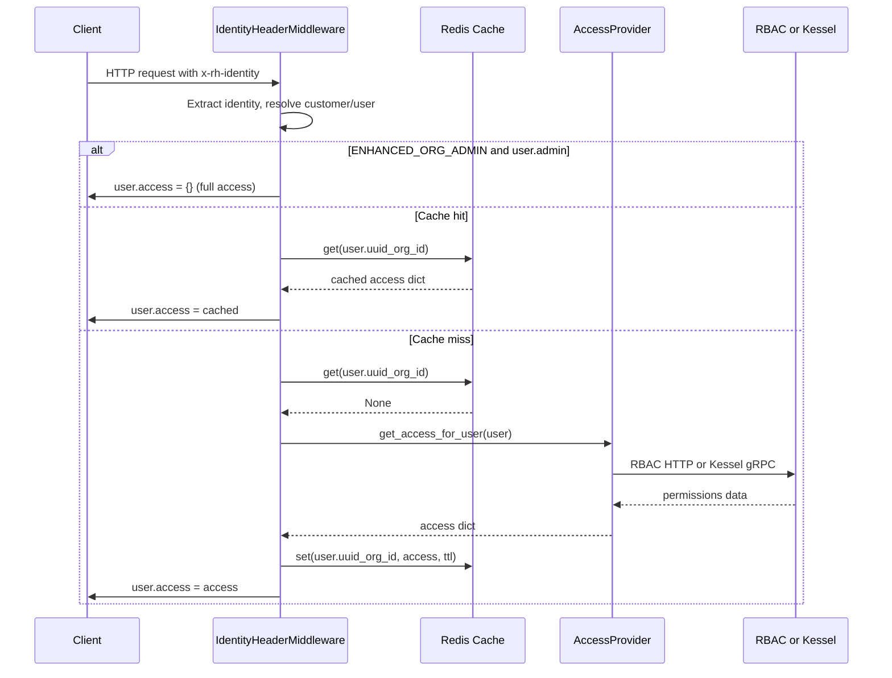
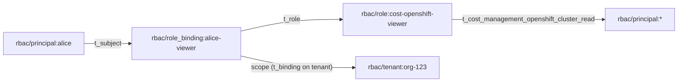

# Kessel/ReBAC Detailed Design -- Cost Management OCP Integration

| Field         | Value                                                                 |
|---------------|-----------------------------------------------------------------------|
| Jira          | [FLPATH-3294](https://issues.redhat.com/browse/FLPATH-3294)          |
| Parent story  | [FLPATH-2690](https://issues.redhat.com/browse/FLPATH-2690)          |
| Epic          | [FLPATH-2799](https://issues.redhat.com/browse/FLPATH-2799)          |
| HLD           | [kessel-ocp-integration.md](./kessel-ocp-integration.md)             |
| Author        | Jordi Gil                                                             |
| Status        | Draft                                                                 |
| Created       | 2026-02-18                                                           |
| Last updated  | 2026-02-18                                                           |

## Table of Contents

1. [Overview and Scope](#1-overview-and-scope)
2. [Configuration and Startup](#2-configuration-and-startup)
3. [AccessProvider Abstraction (Phase 1)](#3-accessprovider-abstraction-phase-1)
4. [Middleware Integration (Phase 1)](#4-middleware-integration-phase-1)
5. [KesselAccessProvider Internals](#5-kesselaccessprovider-internals)
6. [Resource Reporting and Sync (Phase 1)](#6-resource-reporting-and-sync-phase-1)
7. [Access Management API (Phase 1.5)](#7-access-management-api-phase-15)
8. [ZED Schema and Role Seeding](#8-zed-schema-and-role-seeding)
9. [Testing Strategy](#9-testing-strategy)
10. [Deployment and Operations](#10-deployment-and-operations)
11. [Dependencies](#11-dependencies)
12. [Risks and Mitigations](#12-risks-and-mitigations)

---

## 1. Overview and Scope

This document describes the detailed design for integrating Kessel/ReBAC as the authorization backend for Cost Management, replacing RBAC for on-premise deployments and providing a future migration path for SaaS.

### 1.1 Phases

All three phases are delivered in a single branch/PR, using phases as logical checkpoints:

- **Phase 1** -- AccessProvider abstraction, middleware integration, resource reporting, pipeline sync
- **Phase 1.5** -- Access Management REST API for role binding CRUD (Kessel-only endpoints)
- **Phase 2** -- `LookupResources()` as the primary Kessel API for retrieving access lists, complete query-layer transparency

### 1.2 Deployment Matrix

| Environment | Authorization backend | How selected                                                     |
|-------------|-----------------------|------------------------------------------------------------------|
| On-prem     | ReBAC (Kessel)        | `ONPREM=true` forces `AUTHORIZATION_BACKEND=rebac` at startup    |
| SaaS        | RBAC (default)        | `AUTHORIZATION_BACKEND=rbac` (default, no env var needed)        |
| SaaS future | ReBAC (Kessel)        | Unleash flag overrides to `rebac` per org (documented hook only) |

### 1.3 Design Principles

- **Deployment-agnostic code**: The `ONPREM` check is confined to `settings.py` (startup-time derivation). The rest of the codebase reads only `AUTHORIZATION_BACKEND`.
- **Transparent pass-through**: `KesselAccessProvider` returns exactly what Kessel reports. No interpretation, no `"*"` fabrication.
- **Zero changes to query layer**: Koku already supports granular resource ID lists. Permission classes and query filtering work unchanged.
- **Resource lifecycle matches RBAC**: Koku's behavior is identical regardless of backend. Resources are never removed from Kessel.

---

## 2. Configuration and Startup

All new settings are added to [`koku/koku/settings.py`](../../../koku/koku/settings.py).

### 2.1 Backend Selection

```python
ONPREM = ENVIRONMENT.bool("ONPREM", default=False)
AUTHORIZATION_BACKEND = "rebac" if ONPREM else ENVIRONMENT.get_value("AUTHORIZATION_BACKEND", default="rbac")
```

`ONPREM=true` is the only mandatory env var for on-prem. It forces `AUTHORIZATION_BACKEND=rebac` regardless of any explicit `AUTHORIZATION_BACKEND` value.

### 2.2 Kessel Connection

Two separate gRPC services require independent configuration:

```python
KESSEL_RELATIONS_CONFIG = {
    "host": ENVIRONMENT.get_value("KESSEL_RELATIONS_HOST", default="localhost"),
    "port": ENVIRONMENT.int("KESSEL_RELATIONS_PORT", default=9000),
    "tls_enabled": ENVIRONMENT.bool("KESSEL_RELATIONS_TLS_ENABLED", default=False),
    "tls_cert_path": ENVIRONMENT.get_value("KESSEL_RELATIONS_TLS_CERT_PATH", default=""),
}

KESSEL_INVENTORY_CONFIG = {
    "host": ENVIRONMENT.get_value("KESSEL_INVENTORY_HOST", default="localhost"),
    "port": ENVIRONMENT.int("KESSEL_INVENTORY_PORT", default=9081),
    "tls_enabled": ENVIRONMENT.bool("KESSEL_INVENTORY_TLS_ENABLED", default=False),
    "tls_cert_path": ENVIRONMENT.get_value("KESSEL_INVENTORY_TLS_CERT_PATH", default=""),
}
```

### 2.3 Schema Version Tracking

```python
KESSEL_SCHEMA_VERSION = ENVIRONMENT.get_value("KESSEL_SCHEMA_VERSION", default="1")
```

Used by the `kessel_update_schema` management command to determine if a schema migration is needed.

### 2.4 Cache Configuration

A new `kessel` cache entry mirrors the existing `rbac` cache (see [`settings.py` line 294](../../../koku/koku/settings.py#L294)):

```python
class CacheEnum(StrEnum):
    default = "default"
    api = "api"
    rbac = "rbac"
    kessel = "kessel"  # new
    worker = "worker"

KESSEL_CACHE_TTL = ENVIRONMENT.int("KESSEL_CACHE_TTL", default=300)
```

The `CACHES` dict gets a new `CacheEnum.kessel` entry identical in structure to `CacheEnum.rbac`, with `TIMEOUT` set to `KESSEL_CACHE_TTL`. The test `CACHES` block also gets the new entry with `DummyCache`.

### 2.5 App Registration

```python
INSTALLED_APPS = [
    ...
    "kessel",  # new
]

SHARED_APPS = (
    ...
    "kessel",  # new -- KesselSyncedResource lives in public schema
)
```

### 2.6 Bootstrap Configuration

| Setting              | On-prem mandatory? | Purpose                                             |
|----------------------|--------------------|-----------------------------------------------------|
| `ONPREM=true`        | Yes                | Forces `AUTHORIZATION_BACKEND=rebac`                |
| `ENHANCED_ORG_ADMIN` | No (default False) | Temporary bootstrap aid for first admin             |
| `KESSEL_RELATIONS_*` | Yes                | Relations API gRPC endpoint                         |
| `KESSEL_INVENTORY_*` | Yes                | Inventory API gRPC endpoint                         |

---

## 3. AccessProvider Abstraction (Phase 1)

New file: `koku/kessel/access_provider.py`

### 3.1 Protocol Definition

```python
from typing import Protocol

class AccessProvider(Protocol):
    """Authorization backend abstraction."""

    def get_access_for_user(self, user) -> dict | None: ...

    def get_cache_ttl(self) -> int: ...
```

### 3.2 Implementations

**`RBACAccessProvider`** -- wraps existing [`RbacService`](../../../koku/koku/rbac.py#L171) with zero changes to `rbac.py`:

```python
class RBACAccessProvider:
    def __init__(self):
        self._rbac = RbacService()

    def get_access_for_user(self, user) -> dict | None:
        return self._rbac.get_access_for_user(user)

    def get_cache_ttl(self) -> int:
        return self._rbac.get_cache_ttl()
```

**`KesselAccessProvider`** -- calls `LookupResources()` for each resource type, builds the identical dict structure that [`_apply_access()`](../../../koku/koku/rbac.py#L127) returns:

```python
class KesselAccessProvider:
    def __init__(self):
        self._client = get_kessel_client()
        self._cache_ttl = settings.KESSEL_CACHE_TTL

    def get_access_for_user(self, user) -> dict | None:
        # See Section 5 for implementation details
        ...

    def get_cache_ttl(self) -> int:
        return self._cache_ttl
```

### 3.3 Factory

```python
_provider_instance: AccessProvider | None = None
_provider_lock = threading.Lock()

def get_access_provider() -> AccessProvider:
    global _provider_instance
    if _provider_instance is None:
        with _provider_lock:
            if _provider_instance is None:
                if settings.AUTHORIZATION_BACKEND == "rebac":
                    _provider_instance = KesselAccessProvider()
                else:
                    _provider_instance = RBACAccessProvider()
    return _provider_instance
```

Lazy singleton, initialized once at first request. Thread-safe via double-checked locking.

### 3.4 Critical Contract

`KesselAccessProvider.get_access_for_user()` MUST return the same dict shape as `RbacService.get_access_for_user()`:

**RBAC example** (wildcard access):

```python
{
    "aws.account": {"read": ["*"]},
    "openshift.cluster": {"read": ["*"]},
    "cost_model": {"read": ["*"], "write": ["*"]},
    "settings": {"read": ["*"], "write": ["*"]},
    ...
}
```

**ReBAC example** (explicit IDs, no wildcards):

```python
{
    "aws.account": {"read": []},
    "openshift.cluster": {"read": ["cluster-uuid-1", "cluster-uuid-2"]},
    "cost_model": {"read": ["uuid1", "uuid2"], "write": ["uuid1"]},
    "settings": {"read": ["settings-org123"], "write": ["settings-org123"]},
    ...
}
```

### 3.5 Why Zero Changes to Permission Classes and Query Layer

Koku's existing permission classes and query filtering already support both patterns:

- **Permission classes** (Layer 1): gate access with `len(read_access) > 0`. An empty list from ReBAC means "no access" -- handled identically to RBAC returning no permissions.
- **Query engine** (Layer 2): [`QueryParameters._set_access()`](../../../koku/api/query_params.py#L266) checks `has_wildcard(access_list)`. If wildcard, no filtering. If specific IDs, applies `QueryFilter(parameter=access, ...)`. ReBAC always returns specific IDs.
- **Cost model view**: [`CostModelViewSet.get_queryset()`](../../../koku/cost_models/view.py) does `queryset.filter(uuid__in=read_access_list)` when not wildcard.

---

## 4. Middleware Integration (Phase 1)

Modifications to [`koku/koku/middleware.py`](../../../koku/koku/middleware.py).

### 4.1 Changes to IdentityHeaderMiddleware

Replace direct `RbacService` instantiation at [line 235](../../../koku/koku/middleware.py#L235):

```python
# Before
class IdentityHeaderMiddleware(MiddlewareMixin):
    rbac = RbacService()

# After
class IdentityHeaderMiddleware(MiddlewareMixin):
    access_provider = get_access_provider()
```

Update `_get_access()` at [line 270](../../../koku/koku/middleware.py#L270):

```python
def _get_access(self, user):
    if settings.ENHANCED_ORG_ADMIN and user.admin:
        return {}
    return self.access_provider.get_access_for_user(user)
```

### 4.2 Cache Key Selection

Update the cache lookup at [line 370](../../../koku/koku/middleware.py#L370):

```python
cache_name = CacheEnum.kessel if settings.AUTHORIZATION_BACKEND == "rebac" else CacheEnum.rbac
cache = caches[cache_name]
user_access = cache.get(f"{user.uuid}_{org_id}")

if not user_access:
    ...
    try:
        user_access = self._get_access(user)
    except KesselConnectionError as err:
        return HttpResponseFailedDependency({"source": "Kessel", "exception": err})
    except RbacConnectionError as err:
        return HttpResponseFailedDependency({"source": "Rbac", "exception": err})
    cache.set(f"{user.uuid}_{org_id}", user_access, self.access_provider.get_cache_ttl())
```

### 4.3 Settings Sentinel Creation

Add resource reporting hook in `create_customer()` at [line 239](../../../koku/koku/middleware.py#L239), after the customer is saved:

```python
@staticmethod
def create_customer(account, org_id, request_method):
    try:
        with transaction.atomic():
            ...
            if request_method and request_method not in ["GET", "HEAD"]:
                customer.save()
                UNIQUE_ACCOUNT_COUNTER.inc()
                LOG.info("Created new customer from account_id %s and org_id %s.", account, org_id)
                on_resource_created("settings", f"settings-{org_id}", org_id)
    ...
```

### 4.4 Unchanged Behaviors

- `ENHANCED_ORG_ADMIN` bypass (line 272) works identically for both backends
- `DEVELOPMENT_IDENTITY` bypass (line 374) remains unchanged
- `DEVELOPMENT` passthrough remains unchanged

### 4.5 Request Flow



---

## 5. KesselAccessProvider Internals

### 5.1 Execution Flow

```python
def get_access_for_user(self, user) -> dict | None:
    subject = f"principal:{user.username}"
    res_access = {}

    for res_type, operations in RESOURCE_TYPES.items():
        kessel_type = KOKU_TO_KESSEL_TYPE_MAP[res_type]
        for operation in operations:
            kessel_permission = KOKU_TO_KESSEL_PERMISSION_MAP[operation]
            try:
                resource_ids = self._client.lookup_resources(
                    resource_type=kessel_type,
                    subject=subject,
                    permission=kessel_permission,
                )
            except grpc.RpcError as err:
                raise KesselConnectionError(f"Kessel lookup failed for {kessel_type}: {err}")
            curr = res_access.get(res_type, {})
            curr[operation] = list(resource_ids)
            res_access[res_type] = curr

    return res_access if any(
        ids for ops in res_access.values() for ids in ops.values()
    ) else None
```

### 5.2 Transparent Pass-Through Principle

`KesselAccessProvider` returns exactly what Kessel reports:

- The `"*"` wildcard is an RBAC-only concept. ReBAC never produces it.
- If a user has tenant-level access to all clusters, `LookupResources()` returns all cluster IDs. We return them as-is.
- If no resources of a type exist (e.g., no AWS accounts on-prem), Kessel returns nothing and we return `[]`.
- The query layer handles both cases: specific IDs trigger filtered queries, empty lists result in no data or 403 depending on the permission class.

### 5.3 Performance Consideration

Returning explicit ID lists instead of `"*"` means the query layer always applies `WHERE uuid IN (...)` filters. For users with access to many resources, this is functionally equivalent to no filter but marginally less efficient. This is an acceptable trade-off for correctness and deployment-agnostic behavior. Optimization (e.g., query-layer awareness of "all resources" case) can be added later if needed.

### 5.4 Koku-to-Kessel Type Mapping

Defined as a constant in `koku/kessel/access_provider.py`:

| Koku `RESOURCE_TYPES` key  | Kessel resource type                        | Koku DB identifier         |
|-----------------------------|---------------------------------------------|----------------------------|
| `openshift.cluster`         | `cost_management/openshift_cluster`         | `Provider.uuid`            |
| `openshift.node`            | `cost_management/openshift_node`            | node name string           |
| `openshift.project`         | `cost_management/openshift_project`         | namespace name string      |
| `cost_model`                | `cost_management/cost_model`                | `CostModel.uuid`           |
| `settings`                  | `cost_management/settings`                  | `settings-{org_id}`        |
| `aws.account`               | `cost_management/aws_account`               | usage account ID string    |
| `aws.organizational_unit`   | `cost_management/aws_organizational_unit`   | org unit ID string         |
| `azure.subscription_guid`   | `cost_management/azure_subscription`        | subscription GUID string   |
| `gcp.account`               | `cost_management/gcp_account`               | account ID string          |
| `gcp.project`               | `cost_management/gcp_project`               | project ID string          |

All resource types are queried uniformly. No special-casing by type. On on-prem OCP, Kessel has no AWS/Azure/GCP resources registered, so those queries return empty lists naturally.

### 5.5 Permission Mapping

| Koku operation | Kessel permission |
|----------------|-------------------|
| `read`         | `read`            |
| `write`        | `all`             |

---

## 6. Resource Reporting and Sync (Phase 1)

### 6.1 Tracking Model

New file: `koku/kessel/models.py` (registered in `SHARED_APPS` -- public schema):

```python
class KesselSyncedResource(models.Model):
    resource_type = models.CharField(max_length=64)
    resource_id = models.CharField(max_length=256)
    org_id = models.CharField(max_length=64)
    kessel_synced = models.BooleanField(default=False)
    last_synced_at = models.DateTimeField(null=True)
    created_at = models.DateTimeField(auto_now_add=True)

    class Meta:
        db_table = "kessel_synced_resources"
        unique_together = ("resource_type", "resource_id", "org_id")
```

### 6.2 Transparent Resource Reporter

New file: `koku/kessel/resource_reporter.py`

The reporter is called unconditionally by Koku's core code. The backend decides internally what to do:

- **RBAC backend**: all methods are no-ops (RBAC doesn't track individual resources)
- **ReBAC backend**: upserts tracking row in `KesselSyncedResource`, calls Inventory API `ReportResource()`

```python
def on_resource_created(resource_type, resource_id, org_id):
    """Called unconditionally by Koku core code. No-ops for RBAC backend."""
    if settings.AUTHORIZATION_BACKEND != "rebac":
        return
    _sync_resource(resource_type, resource_id, org_id)


def _sync_resource(resource_type, resource_id, org_id):
    obj, created = KesselSyncedResource.objects.update_or_create(
        resource_type=resource_type,
        resource_id=resource_id,
        org_id=org_id,
        defaults={"kessel_synced": False},
    )
    try:
        client = get_kessel_client()
        client.report_resource(resource_type, resource_id, org_id)
        obj.kessel_synced = True
        obj.last_synced_at = timezone.now()
        obj.save()
    except Exception:
        LOG.warning(
            log_json(
                msg="Kessel resource sync failed, will retry",
                resource_type=resource_type,
                resource_id=resource_id,
                org_id=org_id,
            )
        )
```

### 6.3 Hook Points

All hooks call the reporter unconditionally. The reporter no-ops for RBAC.

| Hook location | Resource type | Resource ID | When triggered |
|---|---|---|---|
| [`ProviderBuilder.create_provider_from_source()`](../../../koku/api/provider/provider_builder.py#L116) | `openshift_cluster` | `provider.uuid` | New OCP source registered |
| [`ocp_report_db_accessor.populate_openshift_cluster_information_tables()`](../../../koku/masu/database/ocp_report_db_accessor.py#L749) | `openshift_node`, `openshift_project` | node name, namespace name | Pipeline processes OCP data |
| [`CostModelViewSet.perform_create()`](../../../koku/cost_models/view.py) | `cost_model` | `cost_model.uuid` | New cost model created |
| [`IdentityHeaderMiddleware.create_customer()`](../../../koku/koku/middleware.py#L239) | `settings` | `settings-{org_id}` | New org first seen |

### 6.4 Error Handling

Kessel sync failures are **non-fatal**:
- The resource is created in Postgres normally
- `kessel_synced=False` is recorded in the tracking table
- Retry occurs on the next pipeline cycle (idempotent upsert)

### 6.5 Resource Lifecycle

The design principle is that Koku's behavior is identical regardless of authorization backend.

**RBAC today:**

- **Create**: Koku creates resource in Postgres. RBAC doesn't know. Users with `"*"` see it; users with specific IDs need an admin to add the ID in RBAC UI.
- **Update**: Koku updates in Postgres. RBAC doesn't know or care.
- **Delete**: Koku deletes from Postgres. RBAC doesn't know. Stale IDs in RBAC are harmless.
- **Org removal**: `remove_stale_tenants` drops the Postgres schema. RBAC doesn't know.

**ReBAC mirrors this:**

- **Create**: Koku creates in Postgres. Reporter reports to Kessel (RBAC: no-op). Users with tenant-level bindings see it via `LookupResources()`.
- **Update**: No Kessel action. Resource IDs are immutable (`Provider.uuid`, node name, namespace name, `CostModel.uuid`). Kessel tracks identity, not attributes.
- **Delete**: No Kessel action. Resource stays in Kessel, preserving access to historical cost data. Both backends are append-only for resources.
- **Org removal**: [`remove_stale_tenants`](../../../koku/masu/processor/tasks.py#L1131) drops the Postgres schema. Kessel is NOT touched. If org removal should cascade to Kessel in the future, this task is the hook point.

### 6.6 Complete Resource Lifecycle Summary

| Resource | Created | Updated | Deleted from Kessel? |
|---|---|---|---|
| Role definitions (global) | `kessel_seed_roles` at deploy | `kessel_update_schema` (additive) | Never |
| Settings sentinel (per-org) | `create_customer()` middleware | N/A (sentinel) | Never |
| OCP Cluster | `create_provider_from_source()` | No-op (UUID unchanged) | Never |
| OCP Nodes | `populate_node_table()` pipeline | No-op (name unchanged) | Never |
| OCP Projects | `populate_project_table()` pipeline | No-op (name unchanged) | Never |
| Cost Model | `CostModelViewSet.perform_create()` | No-op (UUID unchanged) | Never |
| Role bindings (per-user) | Access Mgmt API POST | Delete + recreate | Yes, via Access Mgmt API DELETE |

---

## 7. Access Management API (Phase 1.5)

### 7.1 Endpoints

New REST endpoints under `/api/cost-management/v1/access-management/`:

| Method | Path | Description |
|--------|------|-------------|
| `GET` | `/roles/` | List available roles from Kessel |
| `GET` | `/role-bindings/` | List role bindings for current org |
| `POST` | `/role-bindings/` | Create role binding (assign role to user/group) |
| `DELETE` | `/role-bindings/{id}/` | Remove role binding |

### 7.2 Conditional Registration

These endpoints are Kessel-only. They are conditionally registered in [`koku/koku/urls.py`](../../../koku/koku/urls.py) at startup:

```python
if settings.AUTHORIZATION_BACKEND == "rebac":
    urlpatterns += [
        path("api/cost-management/v1/access-management/", include("kessel.urls")),
    ]
```

When RBAC backend is active, these URL patterns are not registered, resulting in HTTP 404 for any requests to these paths.

### 7.3 Authorization

Protected by `SettingsAccessPermission` (write access required). Only users with settings write permissions can manage role bindings.

### 7.4 Cache Invalidation

When role bindings are created or deleted, the affected user's cached access must be invalidated proactively:

```python
def _invalidate_user_cache(user_id, org_id):
    cache = caches[CacheEnum.kessel]
    cache.delete(f"{user_id}_{org_id}")
```

This is called from `POST /role-bindings/` and `DELETE /role-bindings/{id}/` views. For group-level bindings, all users in the group have their cache entries invalidated.

### 7.5 New Files

- `koku/kessel/urls.py` -- route definitions
- `koku/kessel/views.py` -- DRF `ModelViewSet` subclasses
- `koku/kessel/serializers.py` -- DRF serializers for role binding CRUD

---

## 8. ZED Schema and Role Seeding

### 8.1 Production ZED Schema (Current State)

Source: [`RedHatInsights/rbac-config/configs/prod/schemas/schema.zed`](https://github.com/RedHatInsights/rbac-config/blob/master/configs/prod/schemas/schema.zed)

The production schema already defines **23 cost_management permissions** on `rbac/role` (lines 163-208):

```zed
definition rbac/role {
    ...
    permission cost_management_all_all = t_cost_management_all_all
    relation t_cost_management_all_all: rbac/principal:*
    permission cost_management_aws_account_all = t_cost_management_aws_account_all
    relation t_cost_management_aws_account_all: rbac/principal:*
    permission cost_management_aws_account_read = t_cost_management_aws_account_read
    relation t_cost_management_aws_account_read: rbac/principal:*
    permission cost_management_aws_organizational_unit_all = t_cost_management_aws_organizational_unit_all
    relation t_cost_management_aws_organizational_unit_all: rbac/principal:*
    permission cost_management_aws_organizational_unit_read = t_cost_management_aws_organizational_unit_read
    relation t_cost_management_aws_organizational_unit_read: rbac/principal:*
    permission cost_management_azure_subscription_guid_all = t_cost_management_azure_subscription_guid_all
    relation t_cost_management_azure_subscription_guid_all: rbac/principal:*
    permission cost_management_azure_subscription_guid_read = t_cost_management_azure_subscription_guid_read
    relation t_cost_management_azure_subscription_guid_read: rbac/principal:*
    permission cost_management_cost_model_all = t_cost_management_cost_model_all
    relation t_cost_management_cost_model_all: rbac/principal:*
    permission cost_management_cost_model_read = t_cost_management_cost_model_read
    relation t_cost_management_cost_model_read: rbac/principal:*
    permission cost_management_cost_model_write = t_cost_management_cost_model_write
    relation t_cost_management_cost_model_write: rbac/principal:*
    permission cost_management_gcp_account_all = t_cost_management_gcp_account_all
    relation t_cost_management_gcp_account_all: rbac/principal:*
    permission cost_management_gcp_account_read = t_cost_management_gcp_account_read
    relation t_cost_management_gcp_account_read: rbac/principal:*
    permission cost_management_gcp_project_all = t_cost_management_gcp_project_all
    relation t_cost_management_gcp_project_all: rbac/principal:*
    permission cost_management_gcp_project_read = t_cost_management_gcp_project_read
    relation t_cost_management_gcp_project_read: rbac/principal:*
    permission cost_management_openshift_cluster_all = t_cost_management_openshift_cluster_all
    relation t_cost_management_openshift_cluster_all: rbac/principal:*
    permission cost_management_openshift_cluster_read = t_cost_management_openshift_cluster_read
    relation t_cost_management_openshift_cluster_read: rbac/principal:*
    permission cost_management_openshift_node_all = t_cost_management_openshift_node_all
    relation t_cost_management_openshift_node_all: rbac/principal:*
    permission cost_management_openshift_node_read = t_cost_management_openshift_node_read
    relation t_cost_management_openshift_node_read: rbac/principal:*
    permission cost_management_openshift_project_all = t_cost_management_openshift_project_all
    relation t_cost_management_openshift_project_all: rbac/principal:*
    permission cost_management_openshift_project_read = t_cost_management_openshift_project_read
    relation t_cost_management_openshift_project_read: rbac/principal:*
    permission cost_management_settings_all = t_cost_management_settings_all
    relation t_cost_management_settings_all: rbac/principal:*
    permission cost_management_settings_read = t_cost_management_settings_read
    relation t_cost_management_settings_read: rbac/principal:*
    permission cost_management_settings_write = t_cost_management_settings_write
    relation t_cost_management_settings_write: rbac/principal:*
    ...
}
```

**Gap**: These permissions exist on `rbac/role` but are **NOT yet wired** through `rbac/role_binding` or `rbac/tenant`. The `role_binding` and `tenant` definitions in prod only propagate permissions for other services (HBI, notifications, etc.), not cost management. This means the authorization chain `principal -> role_binding -> tenant` cannot yet evaluate cost management permissions. Completing this wiring is part of the schema PR to `rbac-config`.

### 8.2 SaaS Role Definitions

Source: [`RedHatInsights/rbac-config/configs/prod/roles/cost-management.json`](https://github.com/RedHatInsights/rbac-config/blob/master/configs/prod/roles/cost-management.json)

These are the 5 standard roles used in SaaS production. Our `kessel_seed_roles` command must create these exact role instances with the exact same permission mappings:

| Role name | RBAC slug | RBAC permissions | Description |
|---|---|---|---|
| Cost Administrator | `cost-administrator` | `cost-management:*:*` | All cost management permissions |
| Cost Price List Administrator | `cost-price-list-administrator` | `cost-management:cost_model:*`, `cost-management:settings:*` | Cost model and settings read/write |
| Cost Price List Viewer | `cost-price-list-viewer` | `cost-management:cost_model:read`, `cost-management:settings:read` | Cost model and settings read-only |
| Cost Cloud Viewer | `cost-cloud-viewer` | `cost-management:aws.account:*`, `cost-management:aws.organizational_unit:*`, `cost-management:azure.subscription_guid:*`, `cost-management:gcp.account:*`, `cost-management:gcp.project:*` | All cloud resource types |
| Cost OpenShift Viewer | `cost-openshift-viewer` | `cost-management:openshift.cluster:*` | OpenShift cluster read/all |

### 8.3 RBAC Permission to Kessel Relation Mapping

The `kessel_seed_roles` command translates RBAC permission strings from `cost-management.json` into Kessel relation names on `rbac/role`. This mapping is defined as a constant in `koku/kessel/management/commands/kessel_seed_roles.py`:

```python
RBAC_PERMISSION_TO_KESSEL_RELATIONS = {
    "cost-management:*:*": [
        "t_cost_management_all_all",
        "t_cost_management_aws_account_all",
        "t_cost_management_aws_account_read",
        "t_cost_management_aws_organizational_unit_all",
        "t_cost_management_aws_organizational_unit_read",
        "t_cost_management_azure_subscription_guid_all",
        "t_cost_management_azure_subscription_guid_read",
        "t_cost_management_cost_model_all",
        "t_cost_management_cost_model_read",
        "t_cost_management_cost_model_write",
        "t_cost_management_gcp_account_all",
        "t_cost_management_gcp_account_read",
        "t_cost_management_gcp_project_all",
        "t_cost_management_gcp_project_read",
        "t_cost_management_openshift_cluster_all",
        "t_cost_management_openshift_cluster_read",
        "t_cost_management_openshift_node_all",
        "t_cost_management_openshift_node_read",
        "t_cost_management_openshift_project_all",
        "t_cost_management_openshift_project_read",
        "t_cost_management_settings_all",
        "t_cost_management_settings_read",
        "t_cost_management_settings_write",
    ],
    "cost-management:cost_model:*": [
        "t_cost_management_cost_model_all",
        "t_cost_management_cost_model_read",
        "t_cost_management_cost_model_write",
    ],
    "cost-management:cost_model:read": [
        "t_cost_management_cost_model_read",
    ],
    "cost-management:settings:*": [
        "t_cost_management_settings_all",
        "t_cost_management_settings_read",
        "t_cost_management_settings_write",
    ],
    "cost-management:settings:read": [
        "t_cost_management_settings_read",
    ],
    "cost-management:aws.account:*": [
        "t_cost_management_aws_account_all",
        "t_cost_management_aws_account_read",
    ],
    "cost-management:aws.organizational_unit:*": [
        "t_cost_management_aws_organizational_unit_all",
        "t_cost_management_aws_organizational_unit_read",
    ],
    "cost-management:azure.subscription_guid:*": [
        "t_cost_management_azure_subscription_guid_all",
        "t_cost_management_azure_subscription_guid_read",
    ],
    "cost-management:gcp.account:*": [
        "t_cost_management_gcp_account_all",
        "t_cost_management_gcp_account_read",
    ],
    "cost-management:gcp.project:*": [
        "t_cost_management_gcp_project_all",
        "t_cost_management_gcp_project_read",
    ],
    "cost-management:openshift.cluster:*": [
        "t_cost_management_openshift_cluster_all",
        "t_cost_management_openshift_cluster_read",
    ],
}
```

### 8.4 Role Seeding Process

For each role in `cost-management.json`, the seeding command:

1. Creates the role instance tuple: `rbac/role:{slug}` (implicit on first relation write)
2. For each RBAC permission in the role's `access` list:
   - Looks up the corresponding Kessel relations from `RBAC_PERMISSION_TO_KESSEL_RELATIONS`
   - Creates a tuple: `rbac/role:{slug}#{relation} rbac/principal:*`

**Example**: Seeding "Cost OpenShift Viewer" (`cost-openshift-viewer`):

```python
# Permission: cost-management:openshift.cluster:*
# Maps to: t_cost_management_openshift_cluster_all, t_cost_management_openshift_cluster_read

client.create_tuples([
    # Grant the role the openshift cluster 'all' permission
    Tuple(
        subject=SubjectReference(subject=ObjectReference(type="rbac/principal", id="*")),
        relation="t_cost_management_openshift_cluster_all",
        resource=ObjectReference(type="rbac/role", id="cost-openshift-viewer"),
    ),
    # Grant the role the openshift cluster 'read' permission
    Tuple(
        subject=SubjectReference(subject=ObjectReference(type="rbac/principal", id="*")),
        relation="t_cost_management_openshift_cluster_read",
        resource=ObjectReference(type="rbac/role", id="cost-openshift-viewer"),
    ),
])
```

### 8.5 Roles Source

The command supports two sources for role definitions:

- **Default**: Embedded `STANDARD_ROLES` constant derived from production `cost-management.json` (no network required, suitable for air-gapped deployments)
- **`--roles-url` flag**: Fetch from `https://raw.githubusercontent.com/RedHatInsights/rbac-config/master/configs/prod/roles/cost-management.json` (always current, requires network)
- **`--roles-file` flag**: Load from a local file path (for custom role sets or testing)

The embedded constant is the default to ensure the command works in air-gapped on-prem environments. It must be kept in sync with the upstream `cost-management.json` when roles change.

### 8.6 Authorization Hierarchy

Resources are linked directly to the tenant (org-level). Kessel workspaces are not used.

```
principal -> role_binding -> role -> permissions
                         -> tenant (scope)
```

The authorization chain in the production schema follows:



**Workspaces exclusion rationale**: Kessel workspaces (`rbac/workspace`) are organizational containers between tenant and resources, used by inventory services (HBI, ACM) for sub-org grouping. Cost management resources don't need sub-org segmentation -- all resources are at the org level. If a future requirement for cluster grouping (e.g., "production" vs "staging") emerges, workspaces can be added as a layer between tenant and resources without breaking the existing model.

### 8.7 Schema Upgrade Strategy

- **Additive-only policy**: Schema changes only add new types, relations, or permissions. Never remove or rename existing ones.
- **Version tracking**: `KESSEL_SCHEMA_VERSION` env var compared against the deployed schema version.
- **Management command**: `kessel_update_schema` applies pending schema changes. Designed as a Helm post-upgrade hook.

### 8.8 Management Commands

New files in `koku/kessel/management/commands/`:

**`kessel_seed_roles`** -- idempotent, creates standard role instances from SaaS role definitions:

```python
class Command(BaseCommand):
    help = "Seed standard Kessel roles for Cost Management from rbac-config definitions"

    def add_arguments(self, parser):
        parser.add_argument("--roles-url", type=str, help="URL to fetch roles JSON")
        parser.add_argument("--roles-file", type=str, help="Path to local roles JSON")
        parser.add_argument("--dry-run", action="store_true", help="Show what would be created")

    def handle(self, *args, **options):
        if settings.AUTHORIZATION_BACKEND != "rebac":
            self.stdout.write("Skipping: AUTHORIZATION_BACKEND is not rebac")
            return
        roles = self._load_roles(options)
        client = get_kessel_client()
        for role in roles:
            slug = self._to_slug(role["name"])
            kessel_relations = self._resolve_permissions(role["access"])
            if options["dry_run"]:
                self.stdout.write(f"Would seed role: {slug} with {len(kessel_relations)} relations")
                continue
            client.create_tuples(
                self._build_role_tuples(slug, kessel_relations),
                upsert=True,
            )
            self.stdout.write(f"Seeded role: {slug} ({len(kessel_relations)} relations)")
```

Designed as a Helm post-install hook.

**`kessel_update_schema`** -- version-checked, applies schema updates:

```python
class Command(BaseCommand):
    help = "Update Kessel schema to latest version"

    def handle(self, *args, **options):
        if settings.AUTHORIZATION_BACKEND != "rebac":
            self.stdout.write("Skipping: AUTHORIZATION_BACKEND is not rebac")
            return
        current = self._get_deployed_version()
        target = settings.KESSEL_SCHEMA_VERSION
        if current >= target:
            self.stdout.write(f"Schema already at version {current}")
            return
        self._apply_migrations(current, target)
```

Designed as a Helm post-upgrade hook.

---

## 9. Testing Strategy

A separate [test plan document](./kessel-ocp-test-plan.md) maps every feature to specific test scenarios.

### 9.1 Scenario ID Convention

Format: `{TIER}-{MODULE}-{FEATURE}-{NNN}`

| Segment | Values | Description |
|---------|--------|-------------|
| TIER | `UT`, `IT`, `CT`, `E2E` | Unit, Integration, Contract, End-to-End |
| MODULE | `KESSEL`, `MW`, `SETTINGS`, `MASU`, `API`, `COSTMODEL` | Koku module where the test code lives |
| FEATURE | Short mnemonic (e.g., `AP`, `CL`, `RR`, `AUTH`, `SYNC`, `PB`, `SEED`) | Feature under test |
| NNN | `001`-`999` | Sequential scenario number |

### 9.2 Module Reference

| Code | Koku module | Covers |
|------|-------------|--------|
| `KESSEL` | `koku/kessel/` | access_provider, client, resource_reporter, models, views, serializers, management commands |
| `MW` | `koku/koku/middleware.py` | Middleware integration (provider dispatch, caching, error handling) |
| `SETTINGS` | `koku/koku/settings.py` | Configuration and startup derivation |
| `MASU` | `koku/masu/` | Pipeline hook (ocp_report_db_accessor sync) |
| `API` | `koku/api/` | ProviderBuilder hook, URL registration |
| `COSTMODEL` | `koku/cost_models/` | CostModelViewSet hook |

### 9.3 Per-Scenario Format (IEEE 829-Inspired)

Each test scenario follows a structured format:

| Field | Description |
|-------|-------------|
| **ID** | `{TIER}-{MODULE}-{FEATURE}-{NNN}` |
| **Title** | Short descriptive name |
| **Priority** | P0 (Critical), P1 (High), P2 (Medium), P3 (Low) |
| **Business Value** | 1-2 sentences linking the test to a requirement or risk |
| **Phase** | 1, 1.5, or 2 (maps to DD checkpoint) |
| **Fixtures** | Explicit setup: base class, `@override_settings`, `@patch()`, `baker.make()` |
| **Steps** | BDD format: Given / When / Then |
| **Acceptance Criteria** | Concrete pass/fail conditions |

### 9.4 Priority Levels

| Level | Meaning | Triage guidance |
|-------|---------|-----------------|
| P0 (Critical) | Core contract, blocks all downstream | Must fix immediately; blocks PR merge |
| P1 (High) | Key feature, significant user impact | Fix before phase checkpoint |
| P2 (Medium) | Important but not blocking | Fix before final PR merge |
| P3 (Low) | Defensive, unlikely paths | Can defer to follow-up |

### 9.5 Tier Mapping to Koku Infrastructure

| DD tier | Koku runner | Runs in CI? | Kessel needed? |
|---------|-------------|-------------|----------------|
| Tier 1 (Unit) `UT-*` | Django `manage.py test` / tox | Yes | No (mocked gRPC) |
| Tier 2 (Integration) `IT-*` | Django `manage.py test` with `@override_settings` | Yes | No (mocked gRPC) |
| Tier 3 (Contract) `CT-*` | Django `manage.py test` | Yes | No (mocked gRPC) |
| Tier 4 (E2E) `E2E-*` | IQE plugin with new Kessel markers | No (OCP cluster) | Yes (full stack) |

### 9.6 Coverage Target

Greater than 80% code coverage on the `koku/kessel/` module for unit tier (`UT-*`).

---

## 10. Deployment and Operations

### 10.1 On-Prem Required Environment Variables

| Variable | Required | Default | Purpose |
|----------|----------|---------|---------|
| `ONPREM` | Yes | `false` | Forces `AUTHORIZATION_BACKEND=rebac` |
| `KESSEL_RELATIONS_HOST` | Yes | `localhost` | Relations API gRPC host |
| `KESSEL_RELATIONS_PORT` | Yes | `9000` | Relations API gRPC port |
| `KESSEL_INVENTORY_HOST` | Yes | `localhost` | Inventory API gRPC host |
| `KESSEL_INVENTORY_PORT` | Yes | `9081` | Inventory API gRPC port |
| `ENHANCED_ORG_ADMIN` | No | `false` | Temporary bootstrap for first admin |
| `KESSEL_CACHE_TTL` | No | `300` | Access cache TTL in seconds |
| `KESSEL_SCHEMA_VERSION` | No | `1` | Deployed schema version |

### 10.2 Bootstrap Path A -- Gradual (ENHANCED_ORG_ADMIN)

1. Deploy Koku + Kessel/SpiceDB with `ONPREM=true`, `ENHANCED_ORG_ADMIN=true`
2. Run `kessel_seed_roles` (Helm post-install hook)
3. First org admin logs in. `ENHANCED_ORG_ADMIN=True` bypasses Kessel -- full access granted
4. Admin uses Access Management API to create role bindings for other users
5. Set `ENHANCED_ORG_ADMIN=false` and restart. Role bindings now govern access

### 10.3 Bootstrap Path B -- Pre-Configured

1. Deploy Kessel/SpiceDB
2. Run `kessel_seed_roles`
3. Pre-load role bindings via `zed` CLI (`zed relationship create`) or Relations API `ImportBulkTuples` (`POST /v1beta1/tuples/bulkimport`)
4. Deploy Koku with `ONPREM=true` only. Users have access from first login

### 10.4 Operational Characteristics

- **Kessel unavailability**: HTTP 424 (Failed Dependency) on every request until Kessel recovers. No fallback to RBAC.
- **No rollback to RBAC on-prem**: RBAC was never deployed. Fix-forward is the only recovery path.
- **Schema upgrades**: Additive-only. Run `kessel_update_schema` as a Helm post-upgrade hook.

### 10.5 SaaS Future Wiring (Documented Hook Only)

Koku uses Unleash for feature flags via `UnleashClient` (see [`koku/koku/feature_flags.py`](../../../koku/koku/feature_flags.py)). The existing pattern uses `UNLEASH_CLIENT.is_enabled(flag_name, context)` with per-account context.

When SaaS is ready for per-org Kessel rollout, the hook point is in `get_access_provider()`:

```python
def get_access_provider(org_id=None) -> AccessProvider:
    if settings.AUTHORIZATION_BACKEND == "rebac":
        return KesselAccessProvider()
    # Future SaaS hook: per-org Unleash override
    # if org_id and is_feature_flag_enabled_by_account(
    #     org_id, "cost-management.backend.enable-kessel-rebac"
    # ):
    #     return KesselAccessProvider()
    return RBACAccessProvider()
```

This follows the existing Unleash pattern used throughout Koku (e.g., `cost-management.backend.ocp_gpu_cost_model` in [`masu/processor/__init__.py`](../../../koku/masu/processor/__init__.py#L27)). Implementation is deferred -- only the hook point is documented.

---

## 11. Dependencies

### 11.1 Python Packages

Added to `Pipfile`:

| Package | Purpose | Used by |
|---------|---------|---------|
| `relations-grpc-clients-python-kessel-project` | Relations API client (gRPC) | `KesselAccessProvider`, Access Management API views |
| `kessel-sdk` | Inventory API client (gRPC) | Resource reporter |
| `grpcio` | gRPC runtime | Transitive dep of both, explicit in Pipfile |

### 11.2 Relations API Client

Source: [project-kessel/relations-client-python](https://github.com/project-kessel/relations-client-python)

Key stubs:
- `KesselLookupServiceStub`: `LookupResources`, `LookupSubjects`
- `KesselTupleServiceStub`: `CreateTuples` (upsert=True), `ReadTuples`, `DeleteTuples`
- `KesselCheckServiceStub`: `Check`, `CheckBulk`

### 11.3 Inventory API Client

Source: [project-kessel/kessel-sdk-py](https://github.com/project-kessel/kessel-sdk-py)

Key methods:
- `ReportResource` -- report resource existence to Kessel
- `DeleteResource` -- remove resource from Kessel (not used in current scope)

### 11.4 External Schema Dependency (Blocking)

The production ZED schema in [`rbac-config`](https://github.com/RedHatInsights/rbac-config) (`configs/prod/schemas/schema.zed`) defines 23 `cost_management_*` permissions on `rbac/role` but does **not** propagate them through `rbac/role_binding` or `rbac/tenant`. This means `LookupResources()` cannot evaluate cost management permissions even when role bindings exist.

**Scope: OCP-only (13 of 23 permissions).** The initial PR targets on-prem OCP environments only. Cloud permissions (AWS, Azure, GCP) are deferred until SaaS onboarding.

**Jira:** [FLPATH-3319](https://issues.redhat.com/browse/FLPATH-3319)

**Required changes** (PR to [`RedHatInsights/rbac-config`](https://github.com/RedHatInsights/rbac-config)):

1. `rbac/role_binding` -- add 13 OCP-scoped permission arrows using the existing pattern `(subject & t_role->X)`:
   ```zed
   definition rbac/role_binding {
       // ... existing permissions for other services ...
       permission cost_management_all_all = (subject & t_role->cost_management_all_all)
       permission cost_management_openshift_cluster_all = (subject & t_role->cost_management_openshift_cluster_all)
       permission cost_management_openshift_cluster_read = (subject & t_role->cost_management_openshift_cluster_read)
       permission cost_management_openshift_node_all = (subject & t_role->cost_management_openshift_node_all)
       permission cost_management_openshift_node_read = (subject & t_role->cost_management_openshift_node_read)
       permission cost_management_openshift_project_all = (subject & t_role->cost_management_openshift_project_all)
       permission cost_management_openshift_project_read = (subject & t_role->cost_management_openshift_project_read)
       permission cost_management_cost_model_all = (subject & t_role->cost_management_cost_model_all)
       permission cost_management_cost_model_read = (subject & t_role->cost_management_cost_model_read)
       permission cost_management_cost_model_write = (subject & t_role->cost_management_cost_model_write)
       permission cost_management_settings_all = (subject & t_role->cost_management_settings_all)
       permission cost_management_settings_read = (subject & t_role->cost_management_settings_read)
       permission cost_management_settings_write = (subject & t_role->cost_management_settings_write)
   }
   ```

2. `rbac/tenant` -- add 13 OCP-scoped permission arrows using the existing pattern `t_binding->X + t_platform->X`:
   ```zed
   definition rbac/tenant {
       // ... existing permissions for other services ...
       permission cost_management_all_all = t_binding->cost_management_all_all + t_platform->cost_management_all_all
       permission cost_management_openshift_cluster_all = t_binding->cost_management_openshift_cluster_all + t_platform->cost_management_openshift_cluster_all
       permission cost_management_openshift_cluster_read = t_binding->cost_management_openshift_cluster_read + t_platform->cost_management_openshift_cluster_read
       permission cost_management_openshift_node_all = t_binding->cost_management_openshift_node_all + t_platform->cost_management_openshift_node_all
       permission cost_management_openshift_node_read = t_binding->cost_management_openshift_node_read + t_platform->cost_management_openshift_node_read
       permission cost_management_openshift_project_all = t_binding->cost_management_openshift_project_all + t_platform->cost_management_openshift_project_all
       permission cost_management_openshift_project_read = t_binding->cost_management_openshift_project_read + t_platform->cost_management_openshift_project_read
       permission cost_management_cost_model_all = t_binding->cost_management_cost_model_all + t_platform->cost_management_cost_model_all
       permission cost_management_cost_model_read = t_binding->cost_management_cost_model_read + t_platform->cost_management_cost_model_read
       permission cost_management_cost_model_write = t_binding->cost_management_cost_model_write + t_platform->cost_management_cost_model_write
       permission cost_management_settings_all = t_binding->cost_management_settings_all + t_platform->cost_management_settings_all
       permission cost_management_settings_read = t_binding->cost_management_settings_read + t_platform->cost_management_settings_read
       permission cost_management_settings_write = t_binding->cost_management_settings_write + t_platform->cost_management_settings_write
   }
   ```

**Deferred (SaaS follow-up):** The remaining 10 cloud permissions (`cost_management_aws_account_*`, `cost_management_aws_organizational_unit_*`, `cost_management_azure_subscription_guid_*`, `cost_management_gcp_account_*`, `cost_management_gcp_project_*`) will be added when SaaS onboards Kessel for cost management.

Until this PR lands, the E2E flow (`principal -> role_binding -> role -> tenant -> resource`) will not resolve for cost management permissions. Unit and integration tests (which mock gRPC) are unaffected.

### 11.5 External Tooling (Operator Use)

- `zed` CLI -- SpiceDB schema writes, relationship creation, backup/restore (Bootstrap Path B)
- Relations API REST -- `ImportBulkTuples` (`POST /v1beta1/tuples/bulkimport`) for bulk pre-loading

---

## 12. Risks and Mitigations

| Risk | Impact | Mitigation |
|------|--------|------------|
| **ZED schema gap: cost_management permissions not wired through role_binding/tenant** | `LookupResources` will not return results even with correct role bindings because the authorization chain is incomplete | [FLPATH-3319](https://issues.redhat.com/browse/FLPATH-3319): Submit PR to `rbac-config` adding 13 OCP-scoped `cost_management_*` permission propagation through `rbac/role_binding` and `rbac/tenant`. Cloud permissions (10) deferred to SaaS onboarding. **Blocking external dependency** |
| **gRPC in Django WSGI process** | Thread-safety concerns with gRPC channels | Lazy singleton with `threading.Lock`; verify in load tests |
| **Performance: many LookupResources calls** | Up to 14 resource types x 2 operations = 28 gRPC calls per cache miss | Cache aggressively (300s default); batch where SDK supports it |
| **Partial LookupResources failure** | One resource type lookup fails mid-request | Fail entire request with HTTP 424, not partial access |
| **Access Management API contract** | Role/binding CRUD schema depends on Kessel SDK | Schema validated against Kessel Relations API in contract tests |
| **Kessel unavailability** | All requests fail with 424 | Expected operational model; monitoring and alerting required |
| **No RBAC rollback on-prem** | Cannot fall back to RBAC | Fix-forward only; documented in operations guide |
| **SaaS future wiring** | Unleash integration not yet implemented | Documented as hook point in `get_access_provider()` |
| **Large ID lists in WHERE IN** | Performance degradation for users with access to many resources | Acceptable trade-off; optimize with query-layer awareness later |

---

## Appendix A: Files to Create/Modify

### New Files

All in new `koku/kessel/` Django app:

- `koku/kessel/__init__.py`
- `koku/kessel/apps.py` -- Django app configuration
- `koku/kessel/models.py` -- `KesselSyncedResource`
- `koku/kessel/access_provider.py` -- `AccessProvider` Protocol, `RBACAccessProvider`, `KesselAccessProvider`, `get_access_provider()`
- `koku/kessel/resource_reporter.py` -- transparent resource reporting
- `koku/kessel/client.py` -- Kessel gRPC client wrapper (Relations API + Inventory API stubs, lazy init)
- `koku/kessel/exceptions.py` -- `KesselConnectionError`
- `koku/kessel/urls.py` -- Access Management API routes
- `koku/kessel/views.py` -- Access Management API views
- `koku/kessel/serializers.py` -- Access Management API serializers
- `koku/kessel/management/__init__.py`
- `koku/kessel/management/commands/__init__.py`
- `koku/kessel/management/commands/kessel_seed_roles.py`
- `koku/kessel/management/commands/kessel_update_schema.py`

### Modified Files

- `koku/koku/settings.py` -- `AUTHORIZATION_BACKEND`, `KESSEL_*_CONFIG`, `CacheEnum.kessel`, cache entry, app registration
- `koku/koku/middleware.py` -- use `AccessProvider`, dual cache key, `KesselConnectionError` handling, settings sentinel hook
- `koku/koku/urls.py` -- conditional Kessel URL registration
- `koku/api/provider/provider_builder.py` -- `on_resource_created()` call in `create_provider_from_source()`
- `koku/masu/database/ocp_report_db_accessor.py` -- `on_resource_created()` calls in `populate_openshift_cluster_information_tables()`
- `koku/cost_models/view.py` -- `on_resource_created()` call in `perform_create()`
- `Pipfile` -- add `relations-grpc-clients-python-kessel-project`, `kessel-sdk`, `grpcio`

### Unchanged Files

- `koku/api/common/permissions/*.py` -- permission classes already handle both wildcard and granular ID lists
- `koku/api/query_params.py` -- `_set_access()` already filters by specific IDs
- `koku/api/query_handler.py` -- `set_access_filters()` already applies ID-based filters
- `koku/api/resource_types/*/view.py` -- all resource type views already filter by specific IDs
- `koku/cost_models/view.py` `get_queryset()` -- already does `filter(uuid__in=read_access_list)`
- `koku/koku/rbac.py` -- `RbacService` unchanged, wrapped by `RBACAccessProvider`

---

## Appendix B: Kessel gRPC Client Wrapper

New file: `koku/kessel/client.py`

```python
import threading

import grpc
from django.conf import settings

from kessel.exceptions import KesselConnectionError

LOG = logging.getLogger(__name__)

_client_instance = None
_client_lock = threading.Lock()


class KesselClient:
    """Wrapper around Kessel gRPC stubs. Lazy-initialized, thread-safe singleton."""

    def __init__(self):
        self._relations_channel = None
        self._inventory_channel = None
        self._lookup_stub = None
        self._tuple_stub = None
        self._inventory_stub = None

    def _get_relations_channel(self):
        if self._relations_channel is None:
            config = settings.KESSEL_RELATIONS_CONFIG
            target = f"{config['host']}:{config['port']}"
            if config["tls_enabled"]:
                creds = grpc.ssl_channel_credentials(
                    root_certificates=open(config["tls_cert_path"], "rb").read()
                )
                self._relations_channel = grpc.secure_channel(target, creds)
            else:
                self._relations_channel = grpc.insecure_channel(target)
        return self._relations_channel

    def lookup_resources(self, resource_type, subject, permission):
        """Call LookupResources and return list of resource IDs."""
        # Uses KesselLookupServiceStub from relations-grpc-clients-python-kessel-project
        ...

    def report_resource(self, resource_type, resource_id, org_id):
        """Report resource to Kessel Inventory API."""
        # Uses kessel-sdk ReportResource
        ...

    def create_tuples(self, tuples):
        """Create relationship tuples (role bindings)."""
        # Uses KesselTupleServiceStub.CreateTuples
        ...

    def delete_tuples(self, tuples):
        """Delete relationship tuples (role bindings)."""
        # Uses KesselTupleServiceStub.DeleteTuples
        ...


def get_kessel_client() -> KesselClient:
    global _client_instance
    if _client_instance is None:
        with _client_lock:
            if _client_instance is None:
                _client_instance = KesselClient()
    return _client_instance
```
